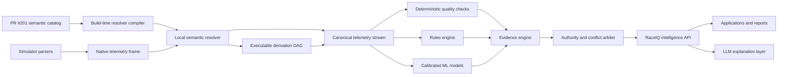
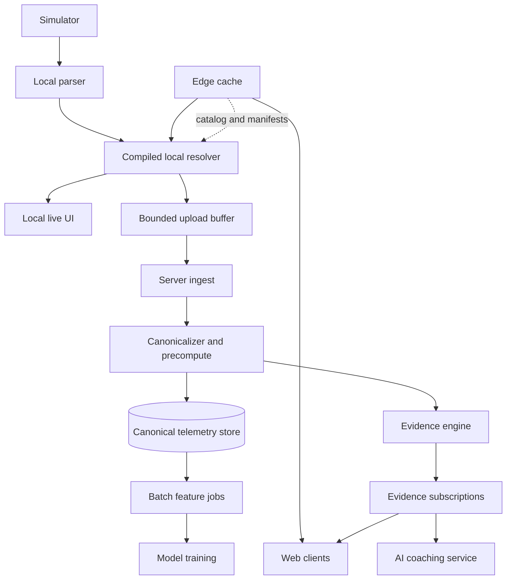
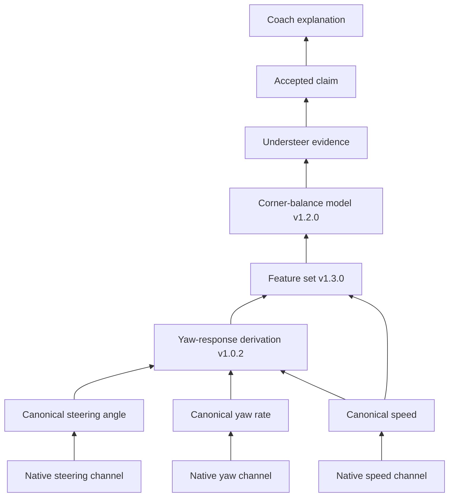
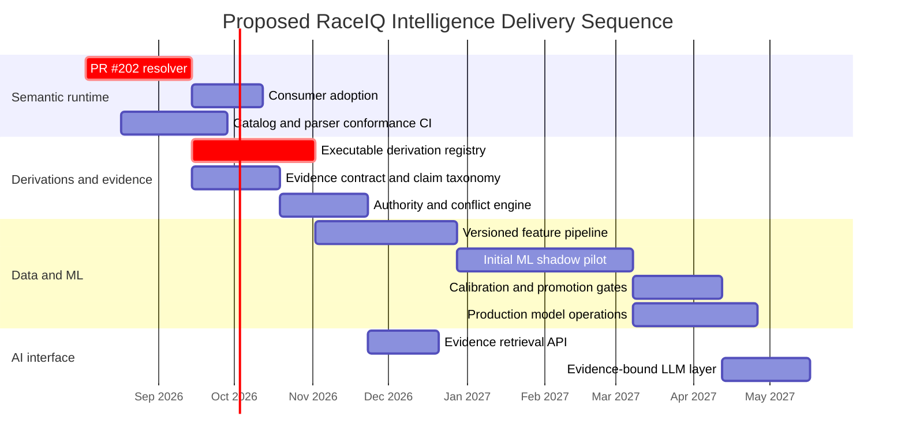

# Authoritative Intelligence Layer for SpeedHQ/RaceIQ

## Executive summary

PR #201 should be treated as the **semantic control plane** for RaceIQ telemetry, not merely as a naming exercise. It establishes simulator-independent semantic identifiers, canonical units, per-game mappings, mapping quality states such as `direct`, `derived`, `simplified`, and `unavailable`, and operational metadata including freshness, retention, provenance, source type, and element cardinality. Those capabilities are the prerequisite for building intelligence that can distinguish a genuinely equivalent signal from an approximate one. fileciteturn4file0L3-L14

The recommended architecture is:



The most important architectural decisions are:

1. **Compile catalog mappings ahead of time.** Live consumers should not parse JSON, search strings, inspect metadata, or allocate rich provenance objects on every telemetry frame.
2. **Separate the hot-path value API from the diagnostic API.** `read(slot)` should be extremely cheap; `resolve()` or `explain()` should return the complete status, confidence, provenance, schema version, and limitations only when requested.
3. **Make derivations a versioned DAG.** Derived values should use semantic inputs and publish semantic outputs, with immutable derivation versions, input requirements, missing-data policies, code hashes, and golden test vectors.
4. **Do not make “ML” synonymous with “authority.”** Authority comes from an ordered evidence system combining source validity, deterministic computation, explicit rules, calibrated ML, provenance, applicability, and uncertainty.
5. **Keep the LLM outside the authority chain.** It may query, summarize, compare, and explain evidence, but it should not convert raw telemetry into authoritative facts.
6. **Store enough raw and versioned canonical data to replay conclusions.** Every evidence item must identify the catalog, resolver, derivation, feature, rule, and model versions used to produce it.
7. **Adopt a hybrid execution topology.** Resolve immediate display values locally, precompute durable canonical and derived data server-side, distribute catalog manifests through edge caching, and stream only requested semantic values and evidence to consumers.

The immediate follow-on should be **PR #202: executable semantic resolution**, followed by a derivation registry, an evidence engine, a carefully scoped ML pilot, and only then an LLM-facing explanation API. PR #201 itself identifies the remaining gap: current consumers still depend on hardcoded packet fields, derivations are descriptive rather than executable, and storage does not yet fully preserve and version every detailed channel. fileciteturn4file0L9-L9

## Repository inventory and implications

### Confirmed PR artifacts

The PR head inspected for this report was commit `b057f1da62af7f3320e343f5acf9bf9de966ab8e`. The following semantic-catalog artifacts were confirmed under `shared/`:

| Repository path | Format | Intended role | Recommended runtime treatment |
|---|---|---|---|
| `shared/TELEMETRY_CATALOG.md` | Generated Markdown | Human-readable review and documentation artifact | Never load at runtime; generate and publish in CI |
| `shared/telemetry-catalog.ts` | TypeScript module | Typed catalog API, compile-time types, or exported catalog representation | Import in build tools and tests; avoid traversing large objects on each frame |
| `shared/telemetry-catalog.generated.json` | Generated JSON | Language-neutral machine-readable catalog | Input to code generation, schema validation, external tooling, and non-TypeScript consumers |

These artifacts embody the central PR #201 contract: stable semantic concepts, canonical units, source mappings, availability or equivalence states, and source-operational metadata. fileciteturn4file0L3-L14

The catalog should be regarded as three related but distinct products:

| Product | Audience | Stability expectation |
|---|---|---|
| Semantic ontology | All RaceIQ components and external integrations | Highest; semantic IDs must not silently change meaning |
| Simulator mapping catalog | Parsers and resolver compiler | Evolves when simulators or parsers change |
| Generated documentation | Developers and reviewers | Can change freely when generated from the authoritative source |

The TypeScript and JSON outputs should include a generator identity and content hash. Without those, two artifacts can claim the same semantic version while containing different mappings.

A recommended top-level manifest is:

```ts
export interface TelemetryCatalogManifest {
  catalogVersion: string;
  schemaVersion: string;
  generatedAt: string;
  generator: {
    name: string;
    version: string;
    commit: string;
  };
  contentHash: string;
  simulators: readonly string[];
  semantics: readonly SemanticDefinition[];
}
```

### Key catalog fields

The exact property names should remain those already selected in PR #201, but the effective information model needs to cover the following concepts:

| Field category | Required information | Why the intelligence layer needs it |
|---|---|---|
| Identity | Semantic ID, display name, description | Stable lookup and human explanation |
| Type | Scalar, boolean, enum, string, vector, fixed array, variable array | Typed resolution and storage |
| Quantity | Canonical unit, dimension, allowed range | Safe conversion and validation |
| Source mapping | Simulator, native channel or path, native unit | Compiled parser-to-semantic access |
| Mapping status | `direct`, `derived`, `simplified`, `unavailable` | Feature eligibility and confidence |
| Temporal behavior | Freshness, update cadence, timestamp basis | Staleness detection and window alignment |
| Retention | Ephemeral, frame, lap, session, durable | State management and storage policy |
| Provenance | Parser/source/version or derivation origin | Reproducibility and conflict resolution |
| Structure | Element count, wheel index, band index, enum domain | Correct handling of arrays and compound values |
| Limitations | Lost detail, simulator-specific interpretation, approximation | Preventing false cross-simulator equivalence |

A semantic mapping must represent more than “where the number comes from.” For example, a single generic tire-temperature value is not necessarily interchangeable with a carcass-center temperature, an inner tire temperature, or a three-band surface measurement. PR #201’s distinction between direct and simplified mappings is therefore an essential model-input constraint, not documentation metadata. fileciteturn4file0L3-L14

### Example mapping view

The generated JSON, rather than a hand-maintained table, should be the source of an automatically generated cross-simulator matrix. The following demonstrates the required shape. The tire semantic and iRacing channel illustrate the mapping visible in the PR material; the remaining native channel spellings should be verified mechanically against the generated JSON and parser adapters before being used as fixtures.

| Semantic concept | iRacing example | ACC-family example | rFactor/LMU-family example | Intelligence implication |
|---|---|---|---|---|
| `vehicle.tire.front-left.carcass-temperature` | `LFtempCM` | Core-temperature element for front-left tire | Wheel-temperature element or simulator-specific approximation | Do not train a detailed carcass model on a `simplified` source without an explicit reduced-feature path |
| Vehicle speed semantic ID | Native speed channel | Native speed channel, commonly exposed in km/h | Native vehicle-speed member | Normalize once to the catalog unit; preserve native unit in provenance |
| Driver throttle semantic ID | Native throttle channel | Native gas/throttle channel | Native unfiltered or filtered throttle member | Record whether the source is raw, filtered, or normalized |
| Driver brake semantic ID | Native brake channel | Native brake channel | Native unfiltered or filtered brake member | Input range and filtering behavior must be part of mapping metadata |
| Steering semantic ID | Native steering-wheel-angle channel | Native steering-angle channel | Native steering member | Wheel angle, normalized control position, and road-wheel angle are not interchangeable |
| Wheel speed semantic ID | Per-wheel native speed | Per-wheel speed array | Per-wheel rotation or speed member | Required for slip calculations; element ordering must be explicit |
| Yaw-rate semantic ID | Native yaw-rate channel or deterministic transformation | Native angular-velocity element | Native local rotational velocity | Axis convention and sign must be normalized before shared models |

This matrix should be generated in CI using a command such as:

```bash
pnpm telemetry-catalog matrix \
  --semantics vehicle.speed,driver.control.throttle,driver.control.brake \
  --simulators iracing,acc,rfactor2,lmu \
  --format markdown
```

The generated report should fail CI when:

- A source channel references a parser field that no longer exists.
- A direct mapping omits a required unit conversion.
- Two definitions reuse one semantic ID with incompatible value types or dimensions.
- A mapping changes from `direct` to `simplified` without an explicit reviewed compatibility change.
- An array mapping lacks element-order metadata.
- A derived mapping references nonexistent semantic inputs.

### Repository integration gaps

Based on the PR’s stated boundary, three integration gaps remain:

| Gap | Consequence | Follow-on work |
|---|---|---|
| Consumers read hardcoded telemetry packet properties | Semantic IDs do not yet control runtime access | PR #202 resolver and adapter generation |
| Derivations are descriptive rather than executable | The catalog can describe availability but cannot produce all values | Versioned derivation registry and DAG executor |
| Detailed values and catalog versions are not uniformly persisted | Historical analysis may not be reproducible | Versioned raw, canonical, and evidence storage envelopes |

These are not shortcomings in PR #201’s scope. They are the correct next layers after establishing the semantic contract. fileciteturn4file0L9-L9

One inventory limitation remains: the confirmed retrieved artifacts identify the generated outputs, but the complete generator-source path, all simulator mapping source files, and the precise CI workflow that regenerates them were not available in the retained repository response. Those paths should be included in the PR #202 design document and made discoverable from a header in every generated artifact.

### Bounded direct-field consumer migration inventory

A repository scan on 2026-08-01 found 78 TypeScript/TSX files outside parser
implementations and catalog code that both reference `TelemetryPacket` and read
normalized packet properties or simulator extensions directly. This is the
bounded migration inventory for Issue #202; adding another direct-field
consumer expands the inventory and must fail review.

Completed vertical slice: `client/src/components/TrackMap.tsx` compiles the
resolver once per simulator, reuses one frame view, and passes semantic
position, velocity, speed, yaw, input, distance, and lap-fraction reads into
`shared/lib/lap-path.ts`. Native packet reads remain there only as the explicit
unavailable-value fallback.

| Migration pull request | Included production paths | Required semantic boundary |
|---|---|---|
| #202-B: shared deterministic analysis | `shared/lib/driving-style.ts`, `shared/lib/lap-insights.ts`, `shared/lib/time-loss.ts`, `shared/lib/vehicle-physics.ts`, `shared/stint-trace.ts`, `shared/games/telemetry.ts` | Control, motion, tire, fuel, and timing slots passed into deterministic calculations |
| #202-C: recording and lap runtime | `server/pipeline.ts`, `server/ws.ts`, `server/lap-detection.ts`, `server/lap-detector*.ts`, `server/sector-tracker.ts`, `server/lap-quality.ts`, `server/lap-metrics.ts`, `server/lap-consistency.ts`, `server/compute-lap-sectors.ts`, `server/acc-lap-rules.ts`, `server/games/*/index.ts` | One compiled resolver per active simulator/parser version; persistence receives canonical values plus version identity |
| #202-D: replay, comparison, export, and routes | `server/db/queries.ts`, `server/comparison.ts`, `server/corner-detection.ts`, `server/export.ts`, `server/experiment-lap-metrics.ts`, `server/routes/lap-routes.ts`, and track/lap route helpers | Replay envelope supplies resolver-backed frames; legacy blobs use the same resolution surface |
| #202-E: server analysis and prompts | `server/ai/analyst-prompt.ts`, `chat-prompt.ts`, `corner-data.ts`, `f1-setup-identity.ts`, `insight-format.ts`, `track-conditions.ts`, `tune-damper-symptoms.ts`, `tune-issues.ts`, `tune-symptoms.ts`, `tune-tire-symptoms.ts`, `tune-weight-transfer.ts` | Prompts consume accepted canonical evidence, while deterministic feature builders consume semantic slots |
| #202-F: analysis and map clients | `client/src/components/analyse/**`, `LapAnalyse.tsx`, `LiveTrackMap.tsx`, `comparison/CompareTrackMap.tsx`, `tunes/track-focus/TrackFocusMap.tsx`, `tunes/track-map-geometry.ts`, and `wireframe/**` | Resolver-backed hooks provide reusable frame views; components do not inspect simulator extensions |
| #202-G: remaining dashboard clients | `client/src/components/{BodyAttitude,CarWireframe,Onboarding}.tsx`, `components/{dashes,f1,telemetry,tunes}/**`, `client/src/lib/{comparison-utils,convert-packet}.ts`, and telemetry query hooks | Subscribe to requested semantic IDs and convert display units only after canonical resolution |

Parser/normalizer code, the resolver compiler itself, the raw replay decoder,
test fixtures, `shared/types.ts`, and reviewed unavailable-value fallback
adapters such as `shared/lib/lap-path.ts` remain deliberate native-field
boundaries. Completion is mechanically bounded: production code outside those
allowlisted boundaries must have zero property reads of normalized
`TelemetryPacket` fields or `packet.f1`, `packet.acc`, and `packet.iracing`.
Each migration pull request must add focused parity tests before removing its
paths from this table; the broader migration program completes when the table is empty.

## Semantic resolver and executable derivations

### Resolver design principles

The resolver needs to satisfy two seemingly conflicting requirements:

- It must return rich semantics, confidence, provenance, versions, and limitations.
- It must impose negligible overhead on high-frequency telemetry consumers.

The solution is a **two-tier API**.

The hot path uses numeric slots and reusable frame views:

```ts
const SPEED = resolver.slot("vehicle.speed");
const speed = frame.readNumber(SPEED);
```

The diagnostic path constructs the complete result only when needed:

```ts
const result = frame.resolveNumber(SPEED);
```

This avoids repeated string hashing, object traversal, unit-dispatch branching, and per-frame result allocation. Semantic strings remain the public identity, but the resolver compiler converts them into compact numeric indices for execution.

### Return contract

The mapping status from PR #201 should be kept separate from runtime availability. A source can be a `direct` mapping but currently be stale, missing, or invalid.

```ts
export type MappingStatus =
  | "direct"
  | "derived"
  | "simplified"
  | "unavailable";

export type ResolutionState =
  | "ok"
  | "missing"
  | "stale"
  | "invalid"
  | "not-applicable"
  | "error";

export interface ResolutionProvenance {
  simulator: string;
  parserId: string;
  parserVersion: string;

  sourceChannel?: string;
  sourceUnit?: string;

  resolverVersion: string;
  catalogVersion: string;
  catalogHash: string;

  derivation?: {
    id: string;
    version: string;
    codeHash: string;
  };

  observedAt: number;
  sourceTimestamp?: number;
}

export interface ConfidenceComponents {
  /**
   * Confidence that the mapping represents the requested semantic concept.
   * This is not a claim about physical sensor accuracy.
   */
  semanticFidelity: number;

  freshness: number;
  inputCompleteness: number;
  derivationReliability?: number;
}

export interface ResolvedValue<T> {
  semanticId: string;
  value: T | null;
  unit: string | null;

  mappingStatus: MappingStatus;
  state: ResolutionState;

  /**
   * Policy-computed summary supplied for convenient gating.
   * Components remain available so consumers do not mistake it for a
   * calibrated model probability.
   */
  confidence: number;
  confidenceComponents: ConfidenceComponents;

  provenance: ResolutionProvenance;
  schemaVersion: string;

  limitations: readonly string[];
}
```

A direct value should not automatically receive “100% confidence” in every sense. Direct means that the simulator exposes a field that maps directly to the concept; it does not establish perfect physical accuracy, sampling quality, or applicability. Keeping confidence components separate prevents semantic fidelity from being confused with model certainty.

### Compiled resolver API

A practical TypeScript API would look like this:

```ts
export type SemanticSlot = number & { readonly __brand: "SemanticSlot" };

export interface RequestedSemantic {
  semanticId: string;
  required?: boolean;
}

export interface ResolverCompileOptions {
  simulator: string;
  requested: readonly RequestedSemantic[];
  rejectSimplified?: boolean;
  staleAfterMs?: Readonly<Record<string, number>>;
}

export interface TelemetryFrameView {
  timestamp: number;

  has(slot: SemanticSlot): boolean;

  readNumber(slot: SemanticSlot): number | undefined;
  readBoolean(slot: SemanticSlot): boolean | undefined;

  resolveNumber(slot: SemanticSlot): ResolvedValue<number>;
  resolveBoolean(slot: SemanticSlot): ResolvedValue<boolean>;

  resolveMany(
    slots: readonly SemanticSlot[],
    target?: ResolvedValue<unknown>[],
  ): readonly ResolvedValue<unknown>[];
}

export interface CompiledResolver<NativeFrame> {
  readonly catalogVersion: string;
  readonly catalogHash: string;
  readonly simulator: string;

  slot(semanticId: string): SemanticSlot;
  createFrameView(
    native: NativeFrame,
    timestamp: number,
    reuse?: TelemetryFrameView,
  ): TelemetryFrameView;
}
```

Consumer usage:

```ts
const resolver = compileTelemetryResolver<IracingFrame>(catalog, {
  simulator: "iracing",
  requested: [
    { semanticId: "vehicle.speed", required: true },
    { semanticId: "driver.control.throttle", required: true },
    {
      semanticId: "vehicle.tire.front-left.carcass-temperature",
      required: false,
    },
  ],
});

const speedSlot = resolver.slot("vehicle.speed");
const throttleSlot = resolver.slot("driver.control.throttle");

const reusableView = resolver.createFrameView(initialFrame, initialTimestamp);

function onTelemetryFrame(frame: IracingFrame, timestamp: number): void {
  const view = resolver.createFrameView(frame, timestamp, reusableView);

  const speed = view.readNumber(speedSlot);
  const throttle = view.readNumber(throttleSlot);

  if (speed !== undefined && throttle !== undefined) {
    liveWidget.update(speed, throttle);
  }
}
```

### Resolver compilation

At build time or simulator-adapter initialization, the compiler should produce a plan similar to:

```ts
interface CompiledOperation {
  outputSlot: number;
  sourceOffset: number;
  sourceType: "f32" | "f64" | "i32" | "u8" | "boolean";

  scale: number;
  offset: number;

  mappingStatus: MappingStatus;
  staleAfterMs: number;
}
```

For common direct conversions, runtime resolution becomes approximately:

```ts
canonicalValue = nativeValue * scale + offset;
```

Complexity should be paid once during compilation, not once per semantic field per frame.

Recommended implementation details include:

- A dense array from semantic slot to compiled operation.
- A generated source accessor rather than dynamic path parsing.
- Presence and validity bitsets.
- Typed arrays for numeric caches.
- A frame-generation counter instead of clearing caches.
- Lazy evaluation: a derivation runs only when its output is requested.
- Per-frame memoization so each derivation runs at most once.
- Small ring buffers allocated only for requested temporal derivations.
- Precomputed unit-conversion coefficients.
- Development-only assertions removed or gated in production builds.

A suitable acceptance budget for PR #202 is a measured threshold rather than an architectural promise: for an agreed representative field set and telemetry frequency, the resolver should consume less than 5% of the existing parsing budget and should perform no steady-state heap allocation in `readNumber()` or `readBoolean()`. Exact microsecond targets should be established from RaceIQ benchmarks rather than guessed.

### Caching strategy

| Cache | Key | Lifetime | Purpose |
|---|---|---|---|
| Catalog cache | `catalogHash` | Process lifetime | One immutable parsed catalog |
| Compiled resolver plan | Simulator, parser version, catalog hash, requested-ID set | Process or bundle lifetime | Eliminate repeated mapping compilation |
| Frame-value cache | Frame generation and semantic slot | One frame | Ensure lazy derivations execute once |
| Temporal state | Session, derivation ID/version, entity | Derivation window or session | Moving windows, rates, and stateful classifications |
| Batch result cache | Data hash, catalog, derivation, feature versions | Durable or LRU | Reproducible replay and offline analysis |
| Evidence cache | Session scope, claim ID, producer version, input watermark | Until inputs change | Avoid repeated rule/model evaluation |

The resolver should not cache values solely by semantic ID. The cache identity must include the frame or input watermark and all producer versions.

### Streaming and batch modes

The same semantic engine should expose two execution surfaces.

```ts
export interface SemanticSubscription {
  ids: readonly string[];
  cadence?: "source" | "10hz" | "1hz" | "lap";
  changesOnly?: boolean;
  includeResolution?: boolean;
}

resolver.subscribe(subscription, event => {
  // Selected semantic values or evidence only.
});
```

Streaming mode should favor:

- Reusable structures.
- Numeric slots.
- Bounded queues.
- Explicit backpressure or sample dropping.
- Event-time timestamps.
- Per-field freshness.
- Requested-field subscriptions.

Batch mode should favor columnar arrays:

```ts
export interface SemanticBatch {
  catalogVersion: string;
  catalogHash: string;
  sessionId: string;

  timestamps: Float64Array;
  columns: ReadonlyMap<SemanticSlot, Float32Array | Float64Array | Int32Array>;
  validity: ReadonlyMap<SemanticSlot, Uint8Array>;
}
```

Columnar storage allows a model or derivation to scan one feature without materializing thousands of frame objects. This follows the same locality and interoperability motivation as Apache Arrow’s columnar memory model [R6].

### Derivation registry

A derivation must be an immutable, versioned producer with a declared contract:

```ts
export interface DerivationDefinition {
  id: string;
  version: string;

  output: {
    semanticId: string;
    unit: string;
    valueType: "number" | "boolean" | "enum";
  };

  inputs: readonly {
    semanticId: string;
    acceptedMappings: readonly MappingStatus[];
    required: boolean;
  }[];

  window?: {
    durationMs?: number;
    samples?: number;
    alignment: "event-time" | "frame-order";
  };

  missingDataPolicy:
    | "unavailable"
    | "hold-last"
    | "interpolate"
    | "partial";

  deterministic: boolean;
  codeHash: string;

  evaluate(context: DerivationContext): DerivationResult;
}
```

An example:

```ts
export const frontLeftSlipRatioV1: DerivationDefinition = {
  id: "raceiq.vehicle-dynamics.slip-ratio.front-left",
  version: "1.0.0",

  output: {
    semanticId: "vehicle.tire.front-left.longitudinal-slip-ratio",
    unit: "ratio",
    valueType: "number",
  },

  inputs: [
    {
      semanticId: "vehicle.speed",
      acceptedMappings: ["direct", "derived"],
      required: true,
    },
    {
      semanticId: "vehicle.wheel.front-left.linear-speed",
      acceptedMappings: ["direct", "derived"],
      required: true,
    },
  ],

  missingDataPolicy: "unavailable",
  deterministic: true,
  codeHash: "sha256:...",

  evaluate(ctx) {
    const vehicleSpeed = ctx.number("vehicle.speed");
    const wheelSpeed = ctx.number(
      "vehicle.wheel.front-left.linear-speed",
    );

    if (vehicleSpeed === undefined || wheelSpeed === undefined) {
      return ctx.unavailable("Required speed input is missing");
    }

    const denominator = Math.max(Math.abs(vehicleSpeed), 0.5);
    return ctx.value((wheelSpeed - vehicleSpeed) / denominator);
  },
};
```

### Authoring format

A hybrid approach is preferable to choosing either an unrestricted DSL or unrestricted TypeScript.

| Authoring mechanism | Appropriate uses | Advantages | Risks |
|---|---|---|---|
| Declarative expression AST stored as JSON | Unit conversion, arithmetic, clamping, vector selection, basic window operations | Portable, inspectable, safe, compilable | Becomes unwieldy for complex state |
| Trusted TypeScript implementation | Vehicle dynamics, state machines, complex temporal logic | Testable, fast, expressive | Requires code review and trusted deployment |
| Arbitrary JavaScript strings in catalog data | None | Superficially flexible | Injection risk, poor tooling, nondeterminism, hard migration |

A safe declarative expression might be:

```json
{
  "id": "raceiq.units.speed.kmh-to-mps",
  "version": "1.0.0",
  "outputSemanticId": "vehicle.speed",
  "expression": {
    "op": "multiply",
    "args": [
      { "source": "native.physics.speedKmh" },
      { "constant": 0.2777777777777778 }
    ]
  }
}
```

The build system should compile this AST into the same operation plan as hand-written adapters. It should not call `eval()`.

### Derivation DAG and reproducibility

At initialization, the registry should:

1. Match available direct mappings.
2. Select eligible derivations for unavailable requested outputs.
3. Resolve each derivation’s semantic inputs recursively.
4. Reject cycles.
5. Topologically order the resulting dependency graph.
6. Compile direct operations and derivations into one execution plan.
7. Report ambiguous producers rather than silently selecting one.

Reproducibility requires the following information to be immutable or persisted:

| Reproducibility input | Required value |
|---|---|
| Semantic interpretation | Catalog version and catalog content hash |
| Native decoding | Parser ID and parser version |
| Derivation implementation | Derivation ID, version, and code hash |
| Temporal semantics | Event-time source, ordering, window size, alignment |
| Missing data | Exact missing, stale, interpolation, and hold policies |
| Numerical behavior | Precision, rounding policy, bounds, constants |
| Input identity | Raw data hash or canonical input watermark |
| Environment where material | Runtime and relevant native-library versions |

Tests should include unit tests, golden recordings, missing-data tests, boundary tests, invariant or property-based tests, replay determinism tests, and cross-simulator conformance tests.

### Re-entry into the semantic catalog

A derived value should not live in a parallel collection of anonymous analytics variables. It should publish a semantic output and retain producer provenance:

```json
{
  "semanticId": "vehicle.tire.front-left.longitudinal-slip-ratio",
  "value": 0.083,
  "unit": "ratio",
  "mappingStatus": "derived",
  "state": "ok",
  "confidence": 0.94,
  "provenance": {
    "catalogVersion": "2.1.0",
    "resolverVersion": "1.0.0",
    "derivation": {
      "id": "raceiq.vehicle-dynamics.slip-ratio.front-left",
      "version": "1.0.0",
      "codeHash": "sha256:..."
    },
    "inputs": [
      "vehicle.speed",
      "vehicle.wheel.front-left.linear-speed"
    ]
  },
  "limitations": [
    "Low-speed denominator is clamped below 0.5 m/s"
  ]
}
```

The catalog defines what the output means. The registry defines how a particular version is produced. A derived producer must not silently redefine the semantic concept.

## Consumer topology and runtime cost

### Recommended hybrid strategy

No single execution location optimizes live latency, infrastructure cost, offline operation, reproducibility, and model governance. RaceIQ should use a hybrid topology:



Local resolution should support immediate HUD and desktop behavior even when disconnected. Server-side processing should own durable canonical data, expensive temporal features, global comparisons, model inference requiring controlled versions, and auditable evidence. Edge caching should distribute immutable catalogs, resolver manifests, model metadata, and low-frequency aggregate snapshots—not attempt to cache every live telemetry sample.

### Strategy comparison

Latency values below are relative design expectations, not measured RaceIQ benchmarks.

| Strategy | Expected latency | Client cost | Server cost | Offline capability | Reproducibility | Best fit | Principal limitation |
|---|---:|---:|---:|---|---|---|---|
| Compiled local resolver | Frame-local; lowest | Low CPU, very low memory when field set is pruned | None during resolution | Full | Good if versions are captured | HUD, live alerts, local recording | Client release may lag catalog or parser changes |
| Local resolver plus local derivations | Frame-local to window-dependent | Moderate for temporal state | None | Full | Good with deterministic registry | Immediate driving feedback | Device variability and harder central governance |
| Server canonicalization | Network plus ingest latency | Low | Moderate | No | Excellent | Durable sessions and shared analysis | Network dependency and ingest cost |
| Server precomputation | Near-real-time or asynchronous | Very low | Moderate to high | No | Excellent | Complex derivations and model features | Compute and storage amplification |
| Edge-cached catalog and manifests | Very low for static artifacts | Very low | Low | Partial after initial fetch | Excellent through content hashes | Catalog distribution and compatibility checks | Not appropriate for per-frame live values |
| Semantic subscription service | Low when field set is restricted | Low | Moderate | No | Good | Browser dashboards and selected evidence | Backpressure, reconnect, and ordering complexity |
| Columnar batch execution | Seconds or more | Usually none | Efficient per sample at scale | Only with downloaded data | Excellent | Training, replay, reports, backfills | Not appropriate for live control loops |

### Consumer subscription model

Consumers should subscribe to semantic concepts, not native simulator packets:

```ts
const subscription = intelligence.subscribe({
  semantics: [
    "vehicle.speed",
    "driver.control.throttle",
    "analysis.handling.corner-balance",
  ],
  cadence: "10hz",
  changesOnly: false,
  includeProvenance: "on-change",
});
```

The server can send a compact schema handshake once:

```json
{
  "type": "semantic-schema",
  "catalogVersion": "2.1.0",
  "catalogHash": "sha256:...",
  "slots": {
    "1": {
      "semanticId": "vehicle.speed",
      "unit": "m/s"
    },
    "2": {
      "semanticId": "driver.control.throttle",
      "unit": "ratio"
    },
    "3": {
      "semanticId": "analysis.handling.corner-balance",
      "unit": "enum"
    }
  }
}
```

Subsequent events can use numeric slots:

```json
{
  "type": "semantic-frame",
  "timestamp": 1785532500123,
  "values": {
    "1": 62.41,
    "2": 0.73,
    "3": "understeer"
  },
  "validity": [1, 1, 1]
}
```

Rich provenance should be emitted:

- At subscription initialization.
- When a producer or mapping changes.
- When a limitation appears or disappears.
- When a consumer explicitly requests explanation.
- With an evidence result.

It need not be repeated in every high-frequency frame.

### Cost controls

The most effective cost control is to compute only what a consumer or product feature requests. The resolver compiler should perform dependency closure from requested outputs, then eliminate every unused mapping and derivation.

For example, a live speed and throttle widget should not initialize:

- Tire-temperature arrays.
- Five-second yaw windows.
- Fuel strategy derivations.
- Model feature pipelines.
- Full provenance objects.

Server-side cost should similarly be controlled by evidence subscriptions and materialization policy:

| Output class | Default materialization |
|---|---|
| Core canonical telemetry used by many products | Persist |
| Cheap deterministic derivations | Compute on read or persist when heavily reused |
| Expensive temporal features | Precompute selectively |
| ML feature tensors | Retain only when required for audit or retraining |
| Model predictions used in user-facing reports | Persist with full version provenance |
| LLM prose | Persist separately from authoritative evidence |

## Intelligence, machine learning, and authority

### Feature engineering contract

ML should never bind directly to parser property names. Every feature must be defined through semantic IDs and explicit quality constraints:

```ts
export interface FeatureDefinition {
  id: string;
  version: string;

  sourceSemanticId: string;
  canonicalUnit: string;

  acceptedMappings: readonly MappingStatus[];
  minimumSemanticFidelity: number;
  maximumAgeMs?: number;

  transform:
    | { type: "identity" }
    | { type: "normalize"; mean: number; standardDeviation: number }
    | { type: "difference"; lagMs: number }
    | { type: "window"; operation: "mean" | "min" | "max" | "std"; durationMs: number }
    | { type: "categorical"; vocabularyVersion: string };

  missingPolicy:
    | "reject-sample"
    | "impute-and-indicate"
    | "use-reduced-model";
}
```

A model package should declare its semantic feature manifest:

```json
{
  "modelId": "raceiq.corner-balance",
  "modelVersion": "1.0.0",
  "featureSet": {
    "id": "corner-balance-features",
    "version": "1.3.0",
    "catalogRange": ">=2.1.0 <3.0.0",
    "features": [
      {
        "semanticId": "driver.control.steering-angle",
        "acceptedMappings": ["direct", "derived"]
      },
      {
        "semanticId": "vehicle.motion.yaw-rate",
        "acceptedMappings": ["direct", "derived"]
      },
      {
        "semanticId": "vehicle.motion.lateral-acceleration",
        "acceptedMappings": ["direct", "derived", "simplified"]
      }
    ]
  }
}
```

This allows the model loader to answer, before inference:

- Are all required concepts available?
- Are their units compatible?
- Are simplified inputs permitted?
- Is the model valid for this simulator, car, track, and telemetry rate?
- Is a reduced model necessary?
- Should the model abstain?

### Appropriate model families

RaceIQ should begin with models whose behavior can be measured and explained, rather than defaulting to deep sequence models.

| Task | Initial model family | Why it is suitable | Example output |
|---|---|---|---|
| Corner-balance classification | Gradient-boosted trees or regularized logistic model | Strong tabular baseline, fast inference, inspectable feature importance | Neutral, understeer, oversteer |
| Driving-phase classification | Rule/state machine baseline, then boosted classifier | Phases have clear temporal and physical structure | Braking, trail braking, rotation, acceleration |
| Lap-time opportunity regression | Gradient boosting or regularized regression | Mixed numeric and categorical features; supports strong baselines | Predicted recoverable milliseconds |
| Tire degradation regression | Hierarchical regression or boosted model with uncertainty | Driver, car, track, and stint effects can be modeled explicitly | Pace-loss estimate and interval |
| Fuel-use prediction | Deterministic baseline plus residual regression | Physics-based baseline preserves interpretability | Fuel per lap and finish reserve |
| Telemetry anomaly detection | Robust statistics first, then isolation or reconstruction models | Labels are sparse; parser regressions often have simple signatures | Sensor/channel anomaly score |
| Driver-style clustering | Carefully normalized embeddings or mixture models | Exploratory segmentation | Braking/aggression/style cluster |
| Long temporal behavior | Temporal convolution or compact sequence model after sufficient data | Captures longer dependencies | Corner sequence or stint-state prediction |

A deterministic baseline must precede each ML model. That establishes whether ML provides enough incremental value to justify operational complexity, a concern emphasized in work on hidden technical debt in production ML systems [R7].

### Cross-simulator training strategy

Canonical names alone do not guarantee identical data-generating processes. Cross-simulator differences can include:

- Physics implementation.
- Sampling frequency.
- noise and filtering.
- Coordinate systems.
- source precision.
- available tire detail.
- weather behavior.
- player-assist effects.
- parser behavior.
- interpretation of apparently similar channels.

The catalog’s mapping status and provenance should therefore become training data, not be discarded.

A defensible sequence is:

| Stage | Training approach | Promotion criterion |
|---|---|---|
| Simulator-specific baseline | Separate model or deterministic baseline per simulator | Establish achievable quality and data issues |
| Shared semantic feature set | Same canonical features, separate evaluation by simulator | No simulator suffers unacceptable degradation |
| Shared model with simulator context | Include simulator or source-domain indicator | Demonstrated improvement over separate baselines |
| Domain adaptation | Reweighting, calibration, or learned adaptation | Only after dataset size and drift justify complexity |
| Unified production model | One artifact with applicability and reduced-feature branches | Meets every simulator-specific acceptance threshold |

Data splitting must prevent leakage. Randomly splitting telemetry frames from the same lap between training and validation would produce unrealistically optimistic results. Splits should be grouped by session and, depending on the task, by driver, track, car, setup, and time period.

Training records should include:

```ts
interface TrainingRowContext {
  pseudonymousDriverId: string;
  sessionId: string;
  lapId?: string;
  cornerId?: string;

  simulator: string;
  simulatorVersion?: string;
  parserVersion: string;

  catalogVersion: string;
  catalogHash: string;
  featureSetVersion: string;

  carId?: string;
  trackId?: string;
  conditionsId?: string;

  sourceQuality: Record<string, ConfidenceComponents>;
}
```

Simplified sources should be handled using one of three explicit policies:

1. Exclude them from models requiring full fidelity.
2. Train a reduced-feature model.
3. Include them with source-domain and missingness indicators, then validate separately.

They should not be silently substituted for direct inputs.

### Confidence calibration

Model output probability, source quality, and applicability are different quantities.

For a classification claim, RaceIQ should retain:

- Raw model score.
- Calibrated class probability.
- Calibration method and version.
- Input semantic fidelity.
- Input freshness and completeness.
- Model applicability to simulator, car, track, and conditions.
- Distribution-shift or out-of-domain score.
- Final policy status: accepted, low confidence, or abstained.

Calibration should be evaluated on held-out groups using metrics such as Brier score, reliability curves, and expected calibration error. Temperature scaling is a simple useful baseline for neural classifiers, while isotonic calibration can work when sufficient representative calibration data exist. Guo and colleagues demonstrated that modern classifiers can be accurate while still being poorly calibrated, making post-hoc calibration a separate production concern [R4].

A single `confidence` field should be treated as a policy summary, not as the only retained uncertainty measure. RaceIQ should avoid arbitrary weighted averaging that makes an attractive but statistically meaningless percentage.

### AnalysisEvidence contract

```ts
export type EvidenceAuthority =
  | "source-observation"
  | "deterministic"
  | "rule"
  | "ml-inference";

export interface AnalysisEvidence<T = unknown> {
  evidenceId: string;
  claimId: string;

  scope: {
    sessionId: string;
    lapId?: string;
    cornerId?: string;
    startTimestamp: number;
    endTimestamp: number;
  };

  authority: EvidenceAuthority;

  result: {
    value: T;
    unit?: string;
    calibratedProbability?: number;
    interval?: {
      lower: number;
      upper: number;
      coverage: number;
    };
  };

  producer: {
    id: string;
    version: string;
    artifactHash: string;
  };

  inputQuality: {
    semanticFidelity: number;
    freshness: number;
    completeness: number;
    outOfDomainScore?: number;
  };

  confidence: number;
  decision: "accepted" | "low-confidence" | "abstained";

  supportingSignals: readonly {
    semanticId: string;
    role: "supporting" | "contradicting" | "context";
    contribution?: number;
  }[];

  provenance: {
    catalogVersion: string;
    catalogHash: string;
    resolverVersion: string;
    featureSetVersion?: string;
    derivationVersions: readonly string[];
  };

  limitations: readonly string[];
  createdAt: string;
}
```

Example ML evidence:

```json
{
  "evidenceId": "ev_01JY...",
  "claimId": "analysis.handling.corner-understeer",
  "scope": {
    "sessionId": "session_42",
    "lapId": "lap_17",
    "cornerId": "corner_6",
    "startTimestamp": 1785532500123,
    "endTimestamp": 1785532504289
  },
  "authority": "ml-inference",
  "result": {
    "value": "moderate",
    "calibratedProbability": 0.87
  },
  "producer": {
    "id": "raceiq.corner-balance-gbdt",
    "version": "1.2.0",
    "artifactHash": "sha256:..."
  },
  "inputQuality": {
    "semanticFidelity": 0.96,
    "freshness": 1.0,
    "completeness": 0.93,
    "outOfDomainScore": 0.08
  },
  "confidence": 0.84,
  "decision": "accepted",
  "supportingSignals": [
    {
      "semanticId": "driver.control.steering-angle",
      "role": "supporting",
      "contribution": 0.29
    },
    {
      "semanticId": "vehicle.motion.yaw-rate",
      "role": "supporting",
      "contribution": 0.27
    },
    {
      "semanticId": "vehicle.motion.lateral-acceleration",
      "role": "supporting",
      "contribution": 0.18
    },
    {
      "semanticId": "driver.control.throttle",
      "role": "context",
      "contribution": 0.08
    }
  ],
  "provenance": {
    "catalogVersion": "2.1.0",
    "catalogHash": "sha256:...",
    "resolverVersion": "1.0.0",
    "featureSetVersion": "1.3.0",
    "derivationVersions": [
      "raceiq.corner-segmentation@1.1.0",
      "raceiq.yaw-response@1.0.2"
    ]
  },
  "limitations": [
    "Front tire slip angle is unavailable for this simulator",
    "Inference used the reduced-feature model"
  ],
  "createdAt": "2026-08-31T19:42:10Z"
}
```

Example abstention:

```json
{
  "claimId": "analysis.tire.front-left.degradation",
  "authority": "ml-inference",
  "result": {
    "value": null
  },
  "producer": {
    "id": "raceiq.tire-degradation",
    "version": "0.4.0",
    "artifactHash": "sha256:..."
  },
  "inputQuality": {
    "semanticFidelity": 0.51,
    "freshness": 1.0,
    "completeness": 0.62,
    "outOfDomainScore": 0.31
  },
  "confidence": 0.38,
  "decision": "abstained",
  "supportingSignals": [],
  "limitations": [
    "Only a simplified tire-temperature source is available",
    "The model requires at least five completed representative laps"
  ]
}
```

Abstention is a successful authoritative outcome. It is preferable to emitting a polished but unsupported conclusion.

### Authority and decision ordering

A robust authority model is not simply “deterministic beats ML.” It asks whether each producer is valid for the claim it is making.

| Order | Evidence class | Appropriate authority |
|---:|---|---|
| Highest | Data validation and safety invariants | Reject impossible, malformed, stale, or unauthorized inputs |
| High | Direct normalized source observation | Establish what the simulator reported |
| High | Deterministic derivation | Establish a precisely defined value when inputs and formula are valid |
| Medium to high | Explicit rule | Apply reviewed domain or product policy |
| Conditional | Calibrated ML inference | Infer latent states or predict outcomes with measured uncertainty |
| None for facts | LLM output | Explain, summarize, compare, and interact with accepted evidence |

Rules and ML often answer different questions. A deterministic slip-ratio calculation can report wheel slip, while a model can infer that the observed pattern is likely driver-induced corner-exit wheelspin. The model does not override the calculation; it creates a separate claim supported by it.

Conflict resolution should operate at the claim level:

```ts
interface ClaimResolutionPolicy {
  claimId: string;
  permittedAuthorities: readonly EvidenceAuthority[];
  minimumConfidence: number;
  maximumInputAgeMs: number;
  conflictStrategy:
    | "highest-authority"
    | "preserve-alternatives"
    | "require-consensus"
    | "abstain-on-conflict";
}
```

The arbiter should consider:

- Whether the evidence addresses the same claim, entity, and time interval.
- Producer authority.
- Mapping fidelity.
- Input freshness and completeness.
- Applicability.
- Producer validation status.
- Version and deprecation status.
- Contradictory evidence.
- Explicit product policy.

It should never silently average a deterministic value and an ML prediction merely because both are numeric.

A decision envelope might be:

```json
{
  "claimId": "analysis.handling.corner-balance",
  "decision": "understeer",
  "status": "accepted",
  "selectedEvidenceId": "ev_01JY...",
  "alternatives": [
    {
      "evidenceId": "ev_rule_...",
      "result": "inconclusive",
      "reasonNotSelected": "Rule threshold was not crossed"
    }
  ],
  "policy": {
    "id": "raceiq.corner-balance-authority",
    "version": "1.0.0"
  }
}
```

### LLM boundary

The LLM should receive structured, selected evidence:

```json
{
  "question": "Why am I losing time in Turn 6?",
  "context": {
    "selectedEvidence": ["ev_01JY...", "ev_01JZ..."],
    "allowedClaims": [
      "analysis.handling.corner-understeer",
      "analysis.technique.throttle-timing",
      "analysis.lap-time.corner-loss"
    ]
  }
}
```

It should not receive unrestricted authority to invent telemetry findings. Its output contract should distinguish evidence-backed assertions from general coaching suggestions:

```ts
interface CoachResponse {
  summary: string;
  findings: readonly {
    text: string;
    evidenceIds: readonly string[];
  }[];
  suggestions: readonly {
    text: string;
    basis: "evidence" | "general-guidance";
  }[];
  unresolved: readonly string[];
}
```

The LLM can say:

> Moderate understeer was detected from apex through early throttle in Turn 6.

only when it references accepted evidence. A suggestion such as trying a later throttle application can be presented as guidance, not as a guaranteed predicted improvement unless a validated model supports that estimate.

## Versioning, storage, security, and operations

### Independent version domains

RaceIQ should not use one global application version to represent every intelligence dependency.

| Version domain | Identifies | Breaking examples |
|---|---|---|
| Catalog schema version | Structure of catalog documents | Renamed required property or changed serialization |
| Semantic catalog version | Meanings, units, and mappings | Semantic meaning or canonical unit change |
| Resolver version | Runtime interpretation and execution | Changed staleness or mapping-selection behavior |
| Parser version | Native simulator decoding | Offset, type, sign, or source field change |
| Derivation version | Formula and temporal behavior | Changed equation, constants, window, or missing policy |
| Rule-policy version | Decision thresholds and precedence | Changed alert or acceptance behavior |
| Feature-set version | Exact model inputs and transformations | Added feature, new normalization, new imputation |
| Model version | Learned artifact and calibration | Retraining, hyperparameter, calibration, or data change |
| Prompt/template version | LLM presentation behavior | Changed instruction or evidence formatting |

Semantic Versioning is an appropriate baseline for software-compatible contracts [R1], but RaceIQ should define domain-specific rules.

A recommended catalog policy is:

| Change | Version treatment |
|---|---|
| Documentation correction with no runtime effect | Patch |
| Additive semantic ID or simulator mapping | Minor |
| Metadata refinement that cannot alter resolution | Patch |
| Mapping quality changes from `direct` to `simplified` | Minor plus compatibility notice, or major if existing acceptance behavior changes |
| Canonical unit change | Major; preferably introduce a new semantic ID when meaning changes |
| Semantic meaning change | Never silent; new ID or major migration |
| Removal of an ID | Deprecate for at least one minor line, then remove in major |
| Native parser-channel correction | Parser patch or minor plus mapping provenance update, depending on impact |

OpenTelemetry’s semantic-convention work offers a useful precedent: semantic names need explicit stability levels, deprecation behavior, and migration periods because widespread consumers depend on their meaning [R3].

### Runtime compatibility manifest

Every deployed intelligence bundle should expose:

```json
{
  "bundleId": "raceiq-intelligence-server",
  "bundleVersion": "1.4.0",
  "catalog": {
    "schemaVersion": "1.0.0",
    "version": "2.1.0",
    "hash": "sha256:..."
  },
  "resolverVersion": "1.0.0",
  "supportedParsers": {
    "iracing": ">=3.4.0 <4.0.0",
    "acc": ">=2.8.0 <3.0.0"
  },
  "derivations": [
    "raceiq.corner-segmentation@1.1.0",
    "raceiq.slip-ratio@1.0.0"
  ],
  "models": [
    "raceiq.corner-balance-gbdt@1.2.0"
  ],
  "authorityPolicyVersion": "1.0.0"
}
```

The service should refuse or downgrade unsupported combinations rather than attempt best-effort interpretation without notifying the consumer.

### Migration strategy

A safe migration sequence is:


For a changed semantic concept:

- Do not reuse the existing ID with a new meaning.
- Add a new ID.
- Publish an alias or migration descriptor only when the relationship is mathematically or semantically safe.
- Support dual resolution during the migration window.
- Record which ID version generated stored canonical values.
- Backfill only when the original raw data and required parser version are available.
- Preserve old model feature manifests for replay.

### Raw, canonical, derived, and evidence storage

A layered storage model is recommended:

| Layer | Content | Primary purpose | Suggested retention posture |
|---|---|---|---|
| Raw/native | Original decoded packet or lossless native record | Reprocessing after parser or catalog changes | Short to configurable; potentially expensive |
| Canonical | Unit-normalized semantic values plus validity and versions | Product queries and shared analytics | Medium or long for opted-in sessions |
| Derived | Deterministic semantic outputs | Avoid repeated expensive computation | Materialize selectively |
| Feature snapshot | Exact values presented to a model | Audit, debugging, and retraining validation | Retain for promoted user-facing predictions where justified |
| Evidence | Claims, uncertainty, inputs, producer versions, limitations | Authoritative product behavior | Longer-lived than ephemeral inference |
| LLM presentation | Generated text and evidence references | UX and conversation history | Separate retention and privacy policy |

A canonical event envelope should include:

```ts
interface CanonicalTelemetryEnvelope {
  sessionId: string;
  sequence: bigint;

  observedAt: number;
  receivedAt: number;

  simulator: string;
  parserVersion: string;

  catalogVersion: string;
  catalogHash: string;
  resolverVersion: string;

  values: readonly {
    slot: number;
    value: number | boolean | string | readonly number[];
    mappingStatus: MappingStatus;
    state: ResolutionState;
  }[];

  rawReference?: {
    objectId: string;
    contentHash: string;
  };
}
```

Raw storage is valuable because a future parser correction or semantic mapping change can be replayed. It is not automatically appropriate to retain every raw frame indefinitely. Retention should be tiered, configurable, and aligned with actual product needs.

### Provenance model

The provenance model should be graph-shaped even if initially serialized as JSON. A claim may depend on several derived values, each depending on native observations.



This is conceptually aligned with the W3C PROV model’s separation of entities, activities, and agents [R2]. RaceIQ does not need to implement the entire standard initially, but using equivalent concepts will prevent provenance from collapsing into a single unstructured string.

### Security and privacy

Telemetry is not necessarily anonymous merely because it lacks a legal name. Sessions can reveal stable driver behavior, schedules, account associations, location-related track participation, device information, or competitive strategy. RaceIQ should therefore apply privacy and security controls from ingestion through training.

| Area | Required control |
|---|---|
| Identity | Use pseudonymous internal driver IDs; keep account linkage in a separately controlled service |
| Data minimization | Collect only channels needed for enabled features and research consent |
| Retention | Separate raw, canonical, evidence, and chat retention policies |
| Access | Tenant and user isolation, least-privilege service roles, auditable administrative access |
| Transport and storage | Encryption in transit and at rest |
| Catalog and code execution | Treat catalogs as data; prohibit arbitrary code evaluation |
| Artifact integrity | Sign or hash catalogs, derivation bundles, feature manifests, and models |
| Parser inputs | Bounds-check lengths, array cardinality, enums, timestamps, and numeric ranges |
| Resource exhaustion | Bound subscriptions, temporal windows, queue depth, session duration, and batch size |
| Model training | Prevent unauthorized sessions from entering training; retain dataset lineage and consent state |
| Poisoning and abuse | Monitor anomalous contributors, parser versions, and label sources |
| LLM boundary | Do not place secrets or unnecessary raw identifiers in prompts; treat user-provided metadata as untrusted |
| Evidence access | Authorize evidence by session and owner, not only by guessable evidence ID |

NIST’s AI Risk Management Framework recommends governing, mapping, measuring, and managing AI risks across the system lifecycle rather than treating model accuracy as the entire risk problem [R5]. For RaceIQ, that means model lineage, data eligibility, applicability, calibration, monitoring, user recourse, and rollback need to be designed alongside training.

### Performance and observability

Each intelligence stage needs independent latency and quality telemetry:

| Stage | Operational metrics |
|---|---|
| Parser | Frames processed, decode duration, malformed frames, dropped frames |
| Resolver | Resolution duration, allocations, missing/stale rates by semantic ID |
| Derivations | Evaluation count, cache-hit rate, window memory, unavailable outputs |
| Streaming | Queue depth, backpressure, dropped/coalesced samples, reconnect gaps |
| ML inference | Batch size, duration, abstention rate, out-of-domain rate |
| Evidence engine | Claims produced, conflicts, rejected evidence, policy decisions |
| Storage | Bytes per session per layer, compression, write delay, replay success |
| LLM | Evidence coverage, unsupported-statement rate, response latency, token usage |

Suggested PR #202 benchmark scenarios are:

- Minimal live consumer with five scalar fields.
- Typical live dashboard with approximately 25–50 fields.
- Analysis consumer with temporal derivations.
- Worst-case requested catalog subset.
- Missing and stale source behavior.
- Multiple subscriptions sharing the same resolver.
- Replay of a long session in batch mode.

Performance regressions should be detected in CI using relative thresholds against a stored baseline. Absolute thresholds should be set only after measuring representative hardware.

## Delivery roadmap and recommendations

### Proposed milestones

The estimates below assume approximately two experienced TypeScript/backend engineers for the semantic and evidence phases, with an ML engineer joining for the model phase. They are planning ranges, not commitments; parser diversity, existing test coverage, and storage maturity are the largest variables.

| Milestone | Core deliverables | Exit criteria | Estimated effort | Primary risks |
|---|---|---|---:|---|
| PR #202 semantic resolver | Catalog loader, generated simulator plans, numeric slots, hot and diagnostic APIs, unit conversion, freshness, microbenchmarks | Selected consumers no longer read native packet fields; zero steady-state hot-path allocation demonstrated | 4–6 engineer-weeks | Catalog shape may not yet encode every runtime requirement |
| Resolver adoption and compatibility | Migrate representative UI, recording, and server consumer; compatibility diagnostics | At least one full simulator path operates entirely through semantic IDs | 2–4 engineer-weeks | Hidden assumptions in existing consumers |
| Executable derivation registry | Hybrid AST/TypeScript registry, DAG compiler, versioning, temporal state, golden fixtures | Derived output can be resolved exactly like direct output with provenance | 4–7 engineer-weeks | Cycles, missing-data semantics, state memory |
| Evidence engine | AnalysisEvidence schema, rules, authority policy, claim conflict handling, storage | Deterministic and rule claims are reproducible from stored inputs | 3–5 engineer-weeks | Claim taxonomy and policy ambiguity |
| Data-quality and feature pipeline | Feature manifests, grouped datasets, quality gates, lineage, simulator-stratified evaluation | Reproducible train/validation datasets with leakage checks | 4–8 engineer-weeks | Insufficient labels, inconsistent sessions, consent |
| Initial ML pilot | One classification task and one regression or anomaly task, calibration, abstention, shadow deployment | Beats deterministic baseline and meets calibration and simulator-specific thresholds | 6–10 engineer-weeks | Domain shift, poor labels, false confidence |
| Production ML operations | Registry, signed artifacts, drift monitoring, rollback, champion/challenger | Model promotion and rollback are automated and auditable | 4–7 engineer-weeks | Operational burden and fragmented versions |
| LLM evidence interface | Structured evidence retrieval, evidence-bound generation, citation IDs, unsupported-claim tests | LLM cannot present telemetry findings without evidence references | 3–5 engineer-weeks | Prompt injection, unsupported synthesis, UX pressure to overstate |
| Broader intelligence expansion | Tire, setup, strategy, driver comparison, additional simulators | Each task has a baseline, evidence contract, and promotion gate | Ongoing | Scope expansion before data quality stabilizes |

### Timeline

The calendar below is an illustrative sequence beginning immediately after July 31, 2026. Some tracks can overlap once the resolver contract stabilizes.



### Recommended PR boundaries

PR #202 should remain narrow enough to review and benchmark:

| Include in PR #202 | Defer from PR #202 |
|---|---|
| Typed catalog loading | ML inference |
| Semantic ID to numeric slot compilation | Full evidence engine |
| Direct and simplified source access | Complex temporal derivations |
| Unit normalization | LLM integration |
| Freshness and runtime state | Durable model-feature storage |
| Hot-path and diagnostic APIs | Broad consumer migration |
| One or two migrated consumers | Every simulator and consumer at once |
| Benchmarks and conformance fixtures | Product-level coaching decisions |

The derivation PR should then add a minimal but complete vertical slice:

- One direct semantic input.
- One deterministic scalar derivation.
- One temporal derivation.
- One unavailable or simplified path.
- Provenance.
- Replay.
- Golden tests.
- A derived value consumed through the same resolver API.

The evidence-engine PR should initially support deterministic and rule-based claims without ML. That ensures the claim taxonomy, provenance, conflict policy, and storage model are sound before probabilistic producers are introduced.

### Decision gates

The program should use explicit gates rather than advancing because a component exists.

| Gate | Required evidence |
|---|---|
| Resolver ready | Correctness fixtures, compatibility report, measured runtime budget, no hot-path allocations |
| Derivation platform ready | Deterministic replay, cycle rejection, versioned provenance, missing-data tests |
| Evidence platform ready | Stable claim IDs, conflict tests, persisted authority decisions |
| Dataset ready | Lineage, consent eligibility, grouped splitting, simulator coverage, label audit |
| Model ready for shadow | Improvement over baseline, calibration report, applicability rules, abstention behavior |
| Model ready for users | Shadow outcomes, simulator-specific thresholds, monitoring, rollback |
| LLM ready | Evidence-bound output tests, unsupported-claim rejection, privacy review |

### Highest-priority actionable recommendations

| Priority | Action | Rationale |
|---:|---|---|
| Immediate | Declare `shared/telemetry-catalog.generated.json` the machine contract and add schema, generator version, and content hash | Prevent generated artifacts from drifting or becoming ambiguous |
| Immediate | Generate a parser-to-semantic conformance matrix in CI | Converts PR #201 mappings into enforceable integration tests |
| Immediate | Design PR #202 around compiled numeric slots and separate hot/diagnostic APIs | Preserves semantic richness without imposing object-allocation overhead |
| Immediate | Define mapping fidelity separately from runtime state and model confidence | Avoids treating `direct`, freshness, and probability as one number |
| Next | Implement a versioned derivation DAG with semantic inputs and outputs | Makes `derived` executable and reproducible |
| Next | Establish `AnalysisEvidence` and claim IDs before training models | Prevents model-specific output formats from becoming the product contract |
| Next | Store catalog, parser, derivation, feature, and model versions with every durable conclusion | Enables replay, migration, and rollback |
| Later | Pilot one bounded ML classification problem with a deterministic baseline | Validates the architecture without prematurely building broad ML infrastructure |
| Later | Expose only accepted evidence to the LLM | Makes the AI an explanation layer rather than an ungoverned telemetry interpreter |

### Open questions and limitations

The following questions should be settled during PR #202 design:

- Which file is the single hand-authored source from which the confirmed Markdown, TypeScript, and JSON artifacts are generated?
- Which CI workflow verifies that generated artifacts are current?
- Are semantic IDs already assigned stable numeric indices, or must indices be bundle-local and derived at build time?
- Does the current parser architecture expose fixed struct offsets, object properties, event messages, or a mixture of all three?
- Which canonical values are already persisted, and at what telemetry cadence?
- What are the actual client hardware and frame-rate performance budgets?
- Which simulator and telemetry license terms constrain raw-data retention or model training?
- What driver consent and deletion behavior already exists?
- Which initial intelligence claim has sufficiently reliable labels to justify an ML pilot?

The exact cross-simulator native channel matrix should be generated directly from the PR #201 JSON and parser definitions rather than copied from this report. The retrieved repository evidence confirmed the generated catalog artifacts and their conceptual contract, but did not preserve the full changed-file listing, generator implementation, every parser field spelling, or CI workflow in a form suitable for line-by-line citation. Those details should therefore be mechanically inventoried as the first PR #202 task rather than inferred.

### References

[R1] Semantic Versioning specification, version 2.0.0.

[R2] World Wide Web Consortium, *PROV-DM: The PROV Data Model*, W3C Recommendation.

[R3] OpenTelemetry, *Semantic Conventions* stability and deprecation guidance.

[R4] Chuan Guo, Geoff Pleiss, Yu Sun, and Kilian Q. Weinberger, “On Calibration of Modern Neural Networks,” *International Conference on Machine Learning*, 2017.

[R5] National Institute of Standards and Technology, *Artificial Intelligence Risk Management Framework*, version 1.0.

[R6] Apache Arrow project, *Columnar Format* specification.

[R7] D. Sculley and colleagues, “Hidden Technical Debt in Machine Learning Systems,” *Advances in Neural Information Processing Systems*, 2015.