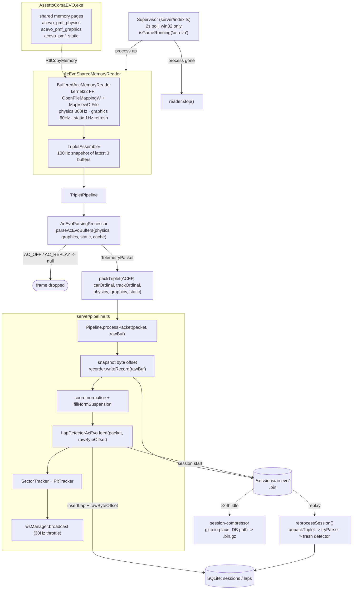

# Assetto Corsa recording pipeline architecture (AC Evo)

How an Assetto Corsa frame travels from the game's shared memory to a lap row
in the database, and which bytes get persisted along the way.

This is really **the Assetto Corsa shared-memory pipeline**. Both Assetto Corsa
titles RaceIQ supports — Competizione and Evo — publish telemetry the same way
(three memory-mapped pages, read and assembled identically), so they run through
one pipeline with two sets of parameters: mapping names, struct layouts, parser,
and lap detector. Everything else is common code.

This document walks that pipeline with **AC Evo** as the worked example. Where a
value is game-specific it is called out as such; where the text says "shared",
it means code both titles run.

One naming wrinkle: the common code physically lives under `server/games/acc/`
and carries `Acc` in its identifiers (`BufferedAccMemoryReader`, the
`ACC_METRICS` env var), because Competizione was implemented first. Those are
historical names, not a statement about scope — AC Evo runs the same classes.

---

## Scope

This document covers the **production** recording path only — what happens on
every session, for every user, with no dev flags set.

The developer dump path (`bun run dev:dump:ac-evo`, `DumpToBinProcessor`,
`AcRecorder`, `readAccFrames`, and the `/dev` import route) is a separate debug
tap that produces test fixtures, not user data. It is documented in
`docs/dev-recordings.md` and deliberately left out here.

The recorder that matters architecturally is the **session recorder**:
`SessionRecorder`, owned by `Pipeline` (`server/pipeline.ts`) via
`RealSessionRecorderAdapter`. It writes one packed triplet per record to
`<DATA_DIR>/sessions/ac-evo/<timestamp>.bin`, each record carrying the `ACEP`
magic (`ACEVO_PACKED_MAGIC`), and laps in the DB store a byte offset into it.

---

## Pipeline graph



---

## Stage by stage

### 1. Process supervision — `server/index.ts`

A single 2s `setInterval` (win32 only) calls `superviseReader("ac-evo", …)`.
The reader is constructed and started **only** while `AssettoCorsaEVO.exe` is
running, and stopped when it disappears. No idle shared-memory polling.

`AcEvoProcessChecker` (`games/ac-evo/process-checker.ts`) exists and emits
`ac-evo-detected` / `ac-evo-lost`, but the central supervisor owns lifecycle —
`AcEvoSharedMemoryReader.start()` calls `_onDetected()` directly.

### 2. Shared memory read — `BufferedAccMemoryReader`

Windows-only, `bun:ffi` against `kernel32.dll`
(`OpenFileMappingW` → `MapViewOfFile` → `RtlCopyMemory` into a fresh `Buffer`).
Connection retries every 10s until all three mappings open.

The reader's defaults are Competizione's, so AC Evo passes overrides for
everything the two titles disagree on:

- Mapping names are `Local\acevo_pmf_*`, not the default `acpmf_*` (confirmed
  with `handle.exe` — AC Evo does not own the `acpmf_*` names).
- Struct sizes come from `PHYSICS.SIZE`, `GRAPHICS_EVO.SIZE`, `STATIC_EVO.SIZE`
  in `games/ac-evo/structs.ts`.
- `sessionIdOffset: null`. Graphics offset 8 in AC Evo v0.6 is a `uint64`
  `focused_car_id_a`, not a stable session id, so change-detected static
  re-reads are disabled. Instead static is re-read on a 1s timer (default
  `staticRefreshMs`), which also catches car/track changes mid-process.

Poll rates: physics 300Hz, graphics 60Hz, static as above. Reads taking >5ms
log a slow-read warning.

### 3. Triplet assembly — `TripletAssembler`

Polls `getLatestBuffers()` at a fixed **100Hz** and fires the callback only when
all three buffers are non-null. This decouples the three different source rates
from one deterministic downstream rate. Metrics (poll interval, callback
duration, missed vs successful triplets) are enabled outside production or with
`ACC_METRICS=1`.

Note: the interval does **not** await the previous async callback. Reentrancy is
the lap detector's problem — see `_lastEmittedLapNumber` below.

### 4. Triplet pipeline — `TripletPipeline`

Processors run in sequence; returning `false` halts the chain for that triplet.
In production AC Evo registers exactly one: `AcEvoParsingProcessor`.

**`StatusCheckProcessor` is deliberately not registered for AC Evo.** In v0.6
the `status` byte at offset 4 of the legacy `acpmf_graphics` page stays 0 even
during live sessions, so gating on it silences every real packet. Status
filtering happens later, inside the parser.

### 5. Parse — `parseAcEvoBuffers`

`games/ac-evo/parser.ts`, with an `AcEvoParserCache` held per processor (and
per reprocess run) so repeated string/ordinal lookups aren't redone each frame.

Returns `null` — dropping the frame — when the buffers are too short, or when
`status` is `AC_OFF` or `AC_REPLAY`. `isRaceOn` is set only for `AC_LIVE`.

Car and track ordinals are resolved from **STATIC display names** via the AC Evo
CSV lookups, not from numeric ids. Unresolved is `-1`, never `0` — ordinal 0 is
a real car/track (Ferrari SF90 Stradale / Monza GP).

### 6. Pack — `packTriplet`

The three raw buffers plus the resolved ordinals are packed into one record so
the session recorder can stay format-agnostic:

```
[magic u32le "ACEP"] [carOrdinal i32le] [trackOrdinal i32le]
[physLen u32le][physics] [graphLen u32le][graphics] [staticLen u32le][static]
```

**This step exists only because Assetto Corsa telemetry arrives as three
separate memory pages.** Forza and F1 are UDP games — one datagram already *is*
the complete record, so there is nothing to assemble or pack. Their listener
hands the raw datagram straight to `processPacket(packet, rawBuf)` and the
session .bin holds the datagram verbatim. Triplet assembler, triplet pipeline,
and `packTriplet` are the multi-channel adapter that makes a shared-memory game
look like a UDP game to everything downstream.

Round-tripping is symmetric: `acEvoServerAdapter.canHandle()` sniffs the `ACEP`
magic and `tryParse()` calls `unpackTriplet()` before re-parsing.

### 7. Session recording + processing — `Pipeline.processPacket`

Shared with every game. Per packet:

1. Snapshot `recorder.getCurrentByteOffset()` **before** writing, then
   `recorder.writeRecord(rawBuf)`. The offset points at this packet.
2. Normalise coordinates (AC Evo is `standard-xyz`, so X is flipped) and fill
   `NormSuspensionTravel`.
3. `detector.feed(packet, rawByteOffset)`.
4. If `recorder.epoch` changed during `feed` — a new session opened mid-feed —
   re-write the packet into the *new* recorder and patch the detector's lap
   offset via `setCurrentLapByteOffset`. Without this, lap 1 of a rotated
   session points into the previous file.
5. Sector/pit tracking, optional live-issue detection, WS broadcast (throttled
   to 30Hz), dev-state broadcast.

Track calibration is skipped for AC Evo — `coordSystem === "standard-xyz"`
already matches outline space.

### 8. Session recorder file format — `SessionRecorder`

Generic session writer for all games:

```
[meta frame: 0xFFFFFFFF u32le][payloadLen=4 u32le][totalFrames u32le]   (12 bytes)
[len u32le][record bytes] ...                                          (repeated)
```

Key behaviours:

- **Lazy open.** The file is not created until the first `writeRecord`. Sessions
  that start and end without records (menu flapping, shutdown) leave no file.
- **Append-only.** A hard kill truncates at most the last in-flight write.
- `totalFrames` is patched into the header on `stop()`.
- `flush()` is called periodically so DB lap offsets never point past EOF.
- Path: `<DATA_DIR>/sessions/ac-evo/<ISO timestamp>.bin`, created in
  `RealSessionRecorderAdapter.start()`, which bumps `epoch`.

`meta.json` (`server/record-meta.ts`) is written atomically alongside session
dirs via tmp-file + rename, carrying gameId, car/track ordinals and names.

### 9. Lap detection — `LapDetectorAcEvo`

`server/lap-detector-ac-evo.ts`, detector id `ac_evo_lapdetector_v2`.

Byte-offset bookkeeping: the first `rawByteOffset` seen after a lap boundary
becomes `_lapByteOffset`; `_lapFrameCount` counts frames. Both are handed to
`insertLap`, giving O(1) seek to a lap's frames on replay.

Boundary rules:

- **Lap complete** when `prev.CurrentLap >= 30 && packet.CurrentLap <= 2` — the
  lap timer resetting from a large value.
- **Session restart** when `DistanceTraveled` drops >100m: buffer cleared, no
  lap emitted.
- **Partial first lap** (`accFirstPacketIsMidLap`) is discarded if it covered
  <100m or classifies as a pit lap.
- **Duplicate guard**: `_lastEmittedLapNumber` blocks the same lap number being
  saved twice when the 100Hz assembler re-enters `emitLap` while DB writes are
  still awaiting.
- **Stale flush**: no packets for 10s (menu/replay, parser returning null) →
  `finalizeCurrentSession()`. Driven by a 5s interval in `pipeline.ts`.

Lap time prefers the trigger packet's `LastLap` when it is fresh — AC Evo writes
`LastLap` atomically with the lap-counter bump — otherwise falls back to
`peakCurrentLap`.

Validity is layered: recording quality (`assessLapRecording`) → pit
classification (`classifyAccPitLap`) → Kunos track limits
(`classifyKunosTrackLimits`, from the per-frame `is_valid_lap` flag). Pit reasons
win over cuts because they explain the whole lap.

Car ordinals: AC Evo has no stable ordinals. When the parser reports `-1` with a
`carModelName`, `resolveCarOrdinal` registers the name in `discovered_cars` and
mints a stable ordinal `>= DISCOVERED_CAR_ORDINAL_BASE` rather than importing an
unresolvable "Unknown Car". Car/track are backfilled onto the session row
(`updateSessionCarTrack`) once the static page populates.

After `insertLap`: `persistLapMetrics` (fuel/tyre precomputed while frames are
still in memory) and `reconcileAutoExclusionsForLap`.

### 10. Post-recording

- **Compression** (`session-compressor.ts`): every 5 min, while no session is
  active, gzip session `.bin` files older than 24h in place and repoint the DB
  row at `.bin.gz`. Orphan `.bin` files with no DB row are compressed too.
- **Reprocessing** (`reprocess.ts`): reads the session file (gunzipping `.gz`
  transparently), skips the meta frame, walks length-prefixed records, calls
  `serverGame.tryParse` (which unpacks the `ACEP` triplet) and feeds a fresh
  detector backed by `CapturingDbAdapter`. Same lap count → in-place index
  update; different count → replace. Bumping `LAP_DETECTOR_AC_EVO_ID` marks
  every prior AC Evo session stale so `/api/sessions/reprocess-stale` backfills.

---

## Shutdown

`gracefulShutdown` on SIGINT/SIGTERM awaits `flushSessionRecorder()` and
`acEvoReader.stop()` (which stops the assembler and the buffered reader) in
parallel. The session recorder buffers through `Bun.file().writer()` — without
this handler the process exits before the buffer drains and the session `.bin`
ends up truncated or zero-length, stranding lap byte offsets past EOF.

---

## Failure modes worth remembering

| Symptom | Cause |
| --- | --- |
| No packets at all, reader "connected" | `StatusCheckProcessor` accidentally registered — AC Evo v0.6 status stays 0 |
| Car/track show as Monza/SF90 wrongly | Something defaulted an unresolved ordinal to `0` instead of `-1` |
| Static fields empty early in session | AC Evo passes no `staticValid` predicate, so the first read is accepted even if the game hasn't populated the page yet — the 1s refresh recovers it, and the detector backfills car/track via `updateSessionCarTrack` |
| Lap offsets point past EOF | Recorder buffer not flushed before the lap row was written |
| Lap 1 replay reads the wrong file | Session rotation mid-`feed` without the `epoch` re-write patch |
| Same lap saved twice | `_lastEmittedLapNumber` guard bypassed; 100Hz assembler re-entered `emitLap` |

---

## File map

| Path | Role |
| --- | --- |
| `server/index.ts` | Reader supervisor, graceful shutdown |
| `server/games/ac-evo/shared-memory.ts` | Reader wiring, processor registration |
| `server/games/ac-evo/parser.ts` | Buffers → `TelemetryPacket`, status gating |
| `server/games/ac-evo/structs.ts` | `PHYSICS` / `GRAPHICS_EVO` / `STATIC_EVO` layouts |
| `server/games/ac-evo/index.ts` | `acEvoServerAdapter` (canHandle / tryParse / detector factory / AI prompt) |
| `server/games/acc/buffered-memory-reader.ts` | kernel32 FFI shared-memory reads |
| `server/games/acc/triplet-assembler.ts` | 100Hz triplet snapshot |
| `server/games/acc/triplet-pipeline.ts` | Processor chain |
| `server/games/shared/pack-triplet.ts` | `ACEP` pack/unpack |
| `server/pipeline.ts` | Shared per-packet processing, session recorder ownership |
| `server/pipeline-adapters.ts` | DB / WS / session-recorder adapter seams |
| `server/session-recorder.ts` | Session `.bin` writer |
| `server/lap-detector-ac-evo.ts` | Lap boundaries, validity, byte offsets |
| `server/reprocess.ts` | Replay a session through a fresh detector |
| `server/session-compressor.ts` | Background gzip of old sessions |
