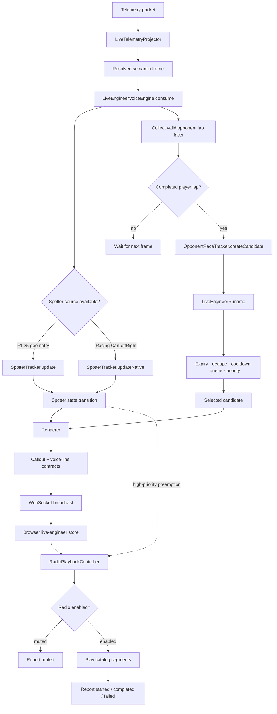

# Live Voice Engineer Engine

## Scope

This document describes **voice-line triggers**, not the full CrewChief parity inventory.

Current production voice output has two families:

- **Opponent pace** — evaluates the player's completed lap against valid opponent lap facts.
- **Spotter** — detects a car alongside the player and announces occupancy transitions.

The CrewChief event catalog contains 24 automatic event names plus `Spotter`. That catalog is a source-coverage contract and semantic-input inventory; it is not a claim that all 25 event families currently emit RaceIQ voice lines.

## End-to-end trigger path

The server decides **whether a line exists and what it means**. The browser decides **whether audio is enabled and when clips play**.

## Voice-line families and triggers

### 1. Opponent pace

One candidate is considered when a new completed player lap is observed.

A candidate is rejected when any of these conditions hold:

- no valid player lap number or lap time;
- player lap is invalid, in pit, or under caution;
- required player identity, class, session, or competitor arrays are missing;
- opponent arrays are missing, mismatched in length, or larger than 64 entries;
- opponent is the player car;
- opponent lap is missing, non-positive, in pit, or invalid;
- no source-backed opponent fact is available for the player's class;
- the same participant has not completed a newer lap;
- the same candidate was already emitted in this timeline.

Opponent facts are collected before the player-lap transition is evaluated. The first frame arms the engine; a later increase in player lap number is required before a player pace candidate can be created.

The benchmark is:

- **practice/qualifying/hotlap**: fastest robust opponent lap in the player's class;
- **race**: fastest opponent's median of the most recent three valid laps.

The resulting relation selects the spoken line:

| Relation | Condition | Priority | Example |
|---|---:|---:|---|
| `fastest-in-class` | Player is more than 0.1% faster than benchmark | high | “Fastest in class.” |
| `setting-race-pace` | Race session and absolute delta is at most 0.1% | normal | “You are setting the current race pace.” |
| `within-class-pace` | Player is up to 0.3% slower than benchmark | low | “You are X from class pace.” |
| `off-class-pace` | Player is more than 0.3% and at most 5% slower | normal | “You are X off class pace.” |
| `outlier-lap` | Player is more than 5% slower | high | “That lap is X off class pace.” |

The automatic line expires after 12 seconds. The runtime queue is capped at three candidates and uses priority, source sequence, candidate expiry, session/timeline identity, semantic dedupe, and the opponent-pace cooldown group before delivery.

### 2. Positional spotter

Spotter events are generated from occupancy transitions, not lap completion.

Implemented states:

| State | Trigger |
|---|---|
| `car-left` | A qualifying opponent first enters the player's left overlap zone |
| `car-right` | A qualifying opponent first enters the player's right overlap zone |
| `still-there` | Existing overlap remains after 3 seconds; repeats no more often than every 3 seconds |
| `three-wide-left` | Existing left overlap remains and at least two opponents occupy the left side on a repeat check |
| `three-wide-right` | Existing right overlap remains and at least two opponents occupy the right side on a repeat check |
| `clear-left` | Previously announced left overlap is absent for at least 500 ms |
| `clear-right` | Previously announced right overlap is absent for at least 500 ms |

The geometric spotter qualifies opponents only when they are inside the lateral/longitudinal track zone, are not too far apart in speed, are connected, and are not in the pit. Formation laps, pit context, caution context, invalid speed, and speeds below 2.78 m/s suppress spotter output.

`clear-left` and `clear-right` are valid text callout states, but currently render with no audio segment. They do not produce a spoken clip.

Source-specific spotter paths:

- **F1 25**: computes relative opponent position from player/opponent world X/Z, player yaw, speed, connectivity, and pit status.
- **iRacing**: consumes native `identity.car-left-right`; values map to left, right, both sides, and three-wide occupancy before the same hysteresis state machine runs.

Spotter lines are high priority and expire after 2 seconds. They bypass the opponent-pace runtime queue, are emitted directly, and therefore can preempt an in-progress lower-priority pace line in the browser.

### 3. Exact pace response

Exact response is not an independent detector. A client sends `live-engineer-voice-request` with action `exact-pace` and a previously emitted pace `decisionId`.

The server returns a higher-precision rendering only when:

- the decision is still retained in the 64-entry decision cache;
- session and timeline epoch still match;
- the callout has not expired;
- current context is not pit or caution;
- renderer returns catalog segments.

Automatic pace uses one decimal place for deltas. Exact response uses three decimal places. Exact response is available wherever opponent pace is available.

## Per-game availability

“Available” in this table means **RaceIQ’s current live engine** has an implemented source path that can emit the family. It does not mean every session has enough data at every frame.

| Game | RaceIQ opponent pace | RaceIQ spotter | Current RaceIQ trigger source and limits | CrewChief source status |
|---|---|---|---|---|
| **F1 25** (`f1-2025`) | **Available** when UDP Session History exposes valid completed-lap facts | **Available** from projected competitor geometry | Pace waits for valid player/opponent lap facts. Spotter uses projected world positions and is suppressed in pit/caution/formation/low-speed contexts. | Source-equivalent mapping; no claim of native CrewChief adapter parity. |
| **iRacing** (`iracing`) | **Available** using SDK/YAML completed-lap facts; conservative track-surface validity is accepted when native competitor validity is absent | **Available** from native `CarLeftRight` | Pace rejects pit-road/ineligible surfaces. Spotter uses native occupancy codes; no synthetic world-pose reconstruction. | Native source-backed coverage with known unavailable competitor fields. |
| **ACC** (`acc`) | **Available** when ACC Broadcasting Protocol supplies valid completed-lap facts | **Available** when ACC Broadcasting Protocol supplies realtime car positions | Shared memory remains player telemetry; registered ACC UDP protocol v4 supplies competitor identity, class, timing, pit/location, speed, and world positions. | **Supported by CrewChief** and now consumed through RaceIQ’s protocol client. |
| **AC Evo** (`ac-evo`) | **Unavailable** | **Unavailable** | Upstream opponent identity, timing, connectivity, and speed are not stable enough for source-backed callouts. | Source is currently treated as unstable/TBD for these competitor fields. |
| **Forza Motorsport** (`fm-2023`) | **Unavailable** | **Unavailable** | No pinned CrewChief/Forza adapter or stable competitor source is present for this engine. | No pinned CrewChief adapter in the referenced source. |

ACC uses two concurrent sources:

- `AccSharedMemoryReader` parses the existing physics, graphics, and static pages for player state.
- `AccBroadcastClient` registers an ACC Broadcasting Protocol v4 UDP client on `127.0.0.1:9000` (overridable with `ACC_BROADCAST_HOST`, `ACC_BROADCAST_PORT`, `ACC_BROADCAST_PASSWORD`, and `ACC_BROADCAST_COMMAND_PASSWORD`).

The broadcast state is joined by `carIndex`, attached to `packet.acc` as runtime-only fields, and resolved through the normal semantic telemetry projector. If the UDP source is absent or incomplete, ACC voice output stays silent; shared-memory telemetry and recording continue.

Unavailable means silent by design. The engine does not fabricate opponent facts or fall back to raw packet-specific guesses.

## Browser delivery triggers

A server voice line does not guarantee audible output. The browser applies these gates:

1. `RadioPlaybackController` selects the current voice line.
2. Spotter and race-engineer settings independently gate playback.
3. Disabled lines report `muted` with `radio-disabled` and advance the queue.
4. Enabled lines report `started`, play catalog segments sequentially, then report `completed`.
5. Audio-blocked, missing, mismatched, or undecodable assets report `failed` with a typed reason.
6. A new spotter line preempts a current opponent-pace line and removes queued pace lines behind the active spotter.
7. Playback volume is controlled client-side; the server never owns browser audio state.

## CrewChief-style trigger inventory

The pinned source reference is `mr_belowski/CrewChiefV4` at commit `147d31f8a5db26d238b59c7d9837b99c0ac78dab`.

The semantic coverage contract currently names these automatic events:

`Position`, `LapCounter`, `Timings`, `LapTimes`, `Opponents`, `Penalties`, `PitStops`, `Fuel`, `Battery`, `WatchedOpponents`, `Strategy`, `RaceTime`, `TyreMonitor`, `EngineMonitor`, `DamageReporting`, `PushNow`, `FlagsMonitor`, `ConditionsMonitor`, `OvertakingAidsMonitor`, `FrozenOrderMonitor`, `Ratings`, `MulticlassWarnings`, `DriverSwaps`, and `SessionEndMessages`.

These names define future trigger families and required semantic groups. Current emitted voice lines remain limited to opponent pace, positional spotter, and exact pace response described above.

## Extension rule

New voice families should follow the same boundary:

1. resolve source-backed semantic values in the live projector;
2. detect a state transition in a server-side tracker;
3. create a versioned callout contract with session, timeline, sequence, priority, and expiry;
4. render deterministic text and catalog segment IDs;
5. let the runtime or explicit high-priority path select delivery;
6. let the browser report playback status.

Do not add a line by reading raw game packets in the renderer or by making the browser infer racing state.

## Source map

- `server/live-strategy/live-engineer-voice-engine.ts` — orchestration and trigger dispatch
- `server/live-strategy/opponent-pace-tracker.ts` — completed-lap benchmark and relation classification
- `server/live-strategy/spotter-tracker.ts` — overlap state machine and hysteresis
- `server/live-strategy/live-engineer-renderer.ts` — text and segment rendering
- `server/live-strategy/live-engineer-runtime.ts` — queue, priority, expiry, dedupe, cooldown
- `shared/racing/live/engineer-contracts.ts` — WebSocket message contracts
- `shared/telemetry/live/semantics.ts` — per-game semantic requirements
- `scripts/catalog/crewchief-callout-coverage.ts` — CrewChief event/group coverage matrix
- `server/games/acc/broadcast-protocol.ts` — ACC Broadcasting Network Protocol v4 binary parser/encoder
- `server/games/acc/broadcast-client.ts` — ACC UDP registration and receive lifecycle
- `server/games/acc/broadcast-state.ts` — ACC entry-list/realtime join and semantic snapshot
- `client/src/stores/live-engineer.ts` — browser callout and voice queues
- `client/src/lib/live-engineer-playback-session.ts` — playback status transitions
