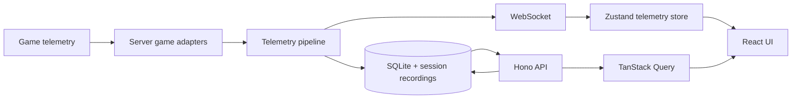

# Architecture Overview

RaceIQ is a Bun server and React client built around a shared, registry-based game model.

## System shape

- `shared/` holds telemetry types, game metadata, and shared game adapters.
- `server/` owns telemetry ingestion, parsing, authoritative session computation, persistence, API routes, and WebSocket broadcast.
- `client/` owns navigation, presentation state, live telemetry rendering, and historical-data queries.
- HTTP and WebSocket traffic uses port `3117` by default. Forza and F1 telemetry use UDP port `5301` by default.

## Current game adapters

Five adapters are registered by `shared/games/init.ts` and `server/games/init.ts`:

| Game | Internal ID | Ingestion | Route prefix |
|---|---|---|---|
| Forza Motorsport 2023 | `fm-2023` | UDP packet parser | `/fm23` |
| F1 25 | `f1-2025` | UDP packet accumulator | `/f125` |
| Assetto Corsa Competizione | `acc` | Windows shared-memory reader | `/acc` |
| Assetto Corsa Evo | `ac-evo` | Windows shared-memory reader | `/ac-evo` |
| iRacing | `iracing` | Windows SDK/shared-memory source | `/iracing` |

Each shared `GameAdapter` owns identity, route prefix, telemetry capabilities, coordinate conventions, and car/track resolution. Each server `ServerGameAdapter` adds the ingestion source, parsing state, lap detector, and analysis context.

## Telemetry data flow

1. UDP sources enter through `server/udp.ts`; native sources enter through their adapter-owned readers.
2. Adapter parsing produces typed `TelemetryPacket` values using each source's coordinate conventions.
3. `server/pipeline.ts` applies coordinate normalization, lap detection, sector and pit tracking, track calibration, persistence callbacks, and live broadcast.
4. Completed sessions and laps are stored in SQLite; raw telemetry is retained through game-specific recording paths for replay and reprocessing.
5. `server/ws.ts` broadcasts live telemetry to `client/src/stores/telemetry.ts`.
6. React components render live state from the store. Historical and administrative data comes through typed Hono RPC and TanStack Query.

## Persistence and API

`server/db/schema.ts` is the typed schema reference. Runtime migrations are embedded in `server/db/migrations.ts` and applied at startup. `server/routes.ts` composes feature route modules under `/api`; the client uses `client/src/lib/rpc.ts` rather than untyped fetch calls.

## Boundaries

- Server is authoritative for telemetry-domain state such as lap boundaries, sector timing, pit estimates, and persisted session results.
- Client may own presentation state, but must not duplicate authoritative telemetry calculations. See [Frontend contribution guide](../contributing/frontend.md).
- Game-specific behavior belongs in registered adapters. Shared consumers resolve the active game instead of falling back to `fm-2023`.
- Pipeline dependencies are injected through `DbAdapter`, `WsAdapter`, and session-recorder adapters so focused code can use real, null, or capturing implementations.

## Related architecture

- [Lap detection](lap-detection.md)
- [Lap telemetry cache](lap-cache.md)
- [Race results](race-results.md)
- [Setup Engineer](setup-engineer.md)
- [Telemetry recording](telemetry-recording.md)
