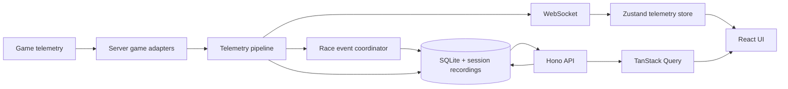

# Architecture Overview

RaceIQ is a Bun server and React client built around a shared, registry-based game model.

## System shape



- `shared/` holds telemetry types, game metadata, and shared game adapters.
- `server/` owns telemetry ingestion, parsing, authoritative session computation, persistence, API routes, and WebSocket broadcast.
- `client/` owns navigation, presentation state, live telemetry rendering, and historical-data queries.
- HTTP and WebSocket traffic uses port `3117` by default. Forza and F1 telemetry use UDP port `5301` by default.

## Current game adapters

Five adapters are registered by `shared/games/init.ts` and `server/games/init.ts`:

| Game | Internal ID | Ingestion | Route prefix |
|---|---|---|---|
| Forza Motorsport 2023 | `fm-2023` | UDP packet parser | `/fm23` |
| F1 25 | `f1-2025` | UDP packet accumulator | `/f125` |
| Assetto Corsa Competizione | `acc` | Windows shared-memory reader | `/acc` |
| Assetto Corsa Evo | `ac-evo` | Windows shared-memory reader | `/ac-evo` |
| iRacing | `iracing` | Windows SDK/shared-memory source | `/iracing` |

Each shared `GameAdapter` owns identity, route prefix, telemetry capabilities, coordinate conventions, and car/track resolution. Each server `ServerGameAdapter` adds the ingestion source, parsing state, lap detector, and analysis context.

## Telemetry data flow

1. UDP sources enter through `server/runtime/udp-listener.ts`; native sources enter through their adapter-owned readers.
2. Adapter parsing produces typed `TelemetryPacket` values using each source's coordinate conventions.
3. `server/telemetry/live-pipeline.ts` applies coordinate normalization, coordinates lap detection and canonical race-event detection, performs track calibration, and activates durable projections before notification.
4. Completed sessions, laps, and the authoritative race-event timeline are stored in SQLite; raw telemetry is retained through game-specific recording paths for replay and transactional rebuild.
5. `server/runtime/websocket-manager.ts` broadcasts live telemetry plus post-commit race-event invalidation messages.
6. React components render live state from the store. Historical timelines and administrative data come through typed Hono RPC and TanStack Query.

## Evidence and authority hierarchy

RaceIQ preserves a one-way evidence and authority hierarchy:

1. Raw telemetry is source evidence.
2. Canonical telemetry is normalized evidence.
3. Events, runs, laps, corners, and segments are durable racing facts.
4. Findings are deterministic interpretations backed by measurements and exact evidence references.
5. ML and AI are consumers that explain or prioritize findings. They are never authorities over findings, racing facts, canonical evidence, or raw evidence.

Generated prose must not redefine or overwrite any lower layer. A questionable AI statement must remain traceable through:

```text
AI statement
  ↓
finding
  ↓
measurement
  ↓
corner / run / lap
  ↓
canonical sample range
  ↓
raw recording or verified source artifact
```

When retained raw evidence is unavailable, provenance must identify the verified canonical archive and source limitation used for the rebuild.

## Persistence and API

`server/db/schema.ts` is the typed schema reference. Runtime migrations are embedded in `server/db/migrations.ts` and applied at startup. `server/routes/index.ts` composes feature route modules under `/api`; the client uses `client/src/lib/rpc.ts` rather than untyped fetch calls.

## Boundaries

- Server is authoritative for telemetry-domain state such as lap boundaries, sector timing, the durable race-event timeline, pit estimates, and persisted session-result projections.
- Client may own presentation state, but must not duplicate authoritative telemetry calculations. See [Frontend contribution guide](../contributing/frontend.md).
- Game-specific behavior belongs in registered adapters. Shared consumers resolve the active game instead of falling back to `fm-2023`.
- Pipeline dependencies are injected through `DbAdapter`, `WsAdapter`, and session-recorder adapters so focused code can use real, null, or capturing implementations.

## Related architecture

- [Lap detection](lap-detection.md)
- [Lap telemetry cache](lap-cache.md)
- [Race results](race-results.md)
- [Race event timeline](race-event-timeline.md)
- [Analysis provenance](analysis-provenance.md)
- [Setup Engineer](setup-engineer.md)
- [Telemetry recording](telemetry-recording.md)
