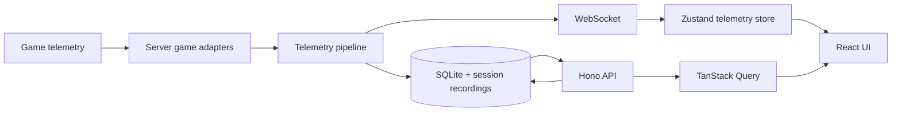

# Architecture Overview

RaceIQ is a Bun server and React client built around a shared, registry-based game model.

## System shape

```mermaid
graph LR
  Games[Game telemetry] --> Adapters[Server game adapters]
  Adapters --> Pipeline[Telemetry pipeline]
  Pipeline --> DB[(SQLite + session recordings)]
  Pipeline --> WS[WebSocket]
  API[Hono API] --> DB
  DB --> API
  WS --> Store[Zustand telemetry store]
  API --> Query[TanStack Query]
  Store --> UI[React UI]
  Query --> UI
```

- `shared/` holds neutral telemetry types, game identities, adapter contracts, and mutable registries, with no concrete metadata dependency.
- `server/` (`@raceiq/backend-core`) owns neutral telemetry pipelines, authoritative session computation, persistence, and shared runtime services.
- `packages/capture-formats/` owns persisted capture layouts and codecs without live-reader dependencies.
- Six `packages/game-<id>/` workspaces own backend adapters, parsers, native sources, recorders, and game-local replay helpers.
- Six `packages/game-<id>-metadata/` workspaces own browser-safe adapters, static metadata, and separate Node car/track catalog leaves.
- `packages/game-catalogs/` owns cross-game adapter registration, name/geometry composition, and assembled setup catalogs.
- `apps/backend/` composes adapters, API routes, boot orchestration, imports, MoTeC targets, and AI workflows.
- `client/` owns navigation, presentation state, live telemetry rendering, and historical-data queries.
- HTTP and WebSocket traffic uses port `3117` by default. Forza and F1 telemetry use UDP port `5301` by default.

## Current game adapters

Six metadata and backend adapters are available. Metadata adapters are composed by `packages/game-catalogs/src/games/init.ts`; backend adapters are registered by `apps/backend/src/games/init.ts`. Both registration lists include iRacing only when the `iracingAdapter` release feature is enabled; the other five adapters are registered unconditionally:

| Game | Internal ID | Ingestion | Route prefix |
|---|---|---|---|
| Forza Motorsport 2023 | `fm-2023` | UDP packet parser | `/fm23` |
| F1 25 | `f1-2025` | UDP packet accumulator | `/f125` |
| Assetto Corsa Competizione | `acc` | Windows shared-memory reader | `/acc` |
| Assetto Corsa Evo | `ac-evo` | Windows shared-memory reader | `/ac-evo` |
| iRacing | `iracing` | Windows SDK/shared-memory source | `/iracing` |
| Le Mans Ultimate | `lmu` | Windows `LMU_Data` shared-memory source | `/lmu` |

Each shared `GameAdapter` owns identity, route prefix, telemetry capabilities, coordinate conventions, and car/track resolution. Each server `ServerGameAdapter` adds parsing and parser-state contracts, runtime policy, a lap-detector factory, and analysis context. Source lifecycle is composed separately: `apps/backend/src/runtime/native-sources.ts` supervises native readers, `live-readers.ts` holds their active instances, and `udp-listener.ts` receives UDP frames.

## Telemetry data flow

1. UDP sources enter through `apps/backend/src/runtime/udp-listener.ts`; native sources enter through their adapter-owned readers.
2. Adapter parsing produces typed `TelemetryPacket` values using each source's coordinate conventions.
3. `server/telemetry/live-pipeline.ts` applies coordinate normalization, lap detection, sector and pit tracking, track calibration, persistence callbacks, and live broadcast.
4. Completed sessions and laps are stored in SQLite; raw telemetry is retained through game-specific recording paths for replay and reprocessing.
5. `server/runtime/websocket-manager.ts` broadcasts live telemetry to `client/src/stores/telemetry.ts`.
6. React components render live state from the store. Historical and administrative data comes through typed Hono RPC and TanStack Query.

## Persistence and API

`server/db/schema.ts` is the typed schema reference. Runtime migrations are embedded in `server/db/migrations.ts` and applied at startup. `apps/backend/src/routes/index.ts` composes feature route modules under `/api`; the client uses `client/src/lib/rpc.ts` rather than untyped fetch calls.

## Boundaries

- Server is authoritative for telemetry-domain state such as lap boundaries, sector timing, pit estimates, and persisted session results.
- Client may own presentation state, but must not duplicate authoritative telemetry calculations. See [Frontend contribution guide](../contributing/frontend.md).
- Game-specific behavior belongs in registered adapters. Shared consumers resolve the active game instead of falling back to `fm-2023`.
- Pipeline dependencies are injected through `DbAdapter`, `WsAdapter`, and session-recorder adapters so focused code can use real, null, or capturing implementations.
- Intended dependency direction: foundation workspaces (`shared`, capture formats, backend core) remain independent of games and application composition; game packages should depend on foundations rather than sibling games, application, tooling, or client. Current game adapters also import assembled geometry/catalog helpers from `packages/game-catalogs/` (for example, `packages/game-fm-2023/src/index.ts`); this is an existing composition exception, not a requirement for new adapters.
- Tests live beside their workspace owners. `packages/frontend-contract-tests/` owns backend-era tests that consume frontend contracts without adding frontend dependencies to backend production packages.

## Related architecture

- [Lap detection](lap-detection.md)
- [Lap telemetry cache](lap-cache.md)
- [Race results](race-results.md)
- [Setup Engineer](setup-engineer.md)
- [Telemetry recording](telemetry-recording.md)
- [LMU recording decision](lmu-recording.md)
