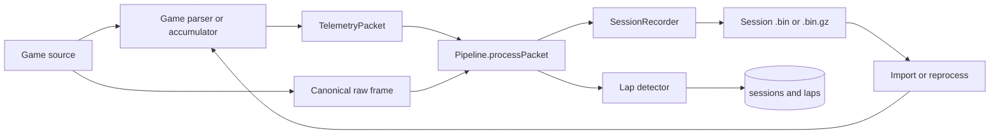

# Telemetry Recording Architecture

RaceIQ retains canonical raw source frames beside normalized lap metadata. Raw retention allows future parser, lap-detector, and derived-channel changes to reprocess existing sessions without another drive.

## Data flow



UDP adapters preserve the original source datagram. ACC and AC Evo pack their three shared-memory pages with adapter magic and resolved ordinals. iRacing preserves its versioned session/value-delta source frames.

## Canonical session file

`server/session-recorder.ts` writes one append-only file per session:

```text
[0xFFFFFFFF u32][payload length = 4 u32][total frames u32]
[record length u32][raw record bytes]
[record length u32][raw record bytes]
...
```

The first telemetry record creates the file; sessions with no records leave no file. `total frames` is patched when the recorder stops. A truncated final record does not invalidate earlier records because each payload is length-prefixed.

Before each write, `Pipeline.processPacket()` snapshots the recorder byte offset and passes it to the active lap detector. Completed lap rows therefore identify the first raw record and frame count for an O(1) seek into the session capture.

Session rotation can occur while a detector handles a packet. `Pipeline` compares recorder epochs, writes the triggering frame to the new file when necessary, and patches the detector's current-lap offset. This keeps lap-one offsets in the correct recording.

## Source records by game

| Game | Canonical raw record |
|---|---|
| Forza Motorsport 2023 | UDP datagram accepted by `parseForzaPacket()` |
| F1 25 | UDP datagram accepted by `F1StateAccumulator` |
| ACC | `ACCP` packed physics, graphics, and static pages |
| AC Evo | `ACEP` packed physics, graphics, and static pages |
| iRacing | `IRIQ` versioned session or value-delta source frame |

Shared-memory packed triplets use:

```text
[magic u32][car ordinal i32][track ordinal i32]
[physics length u32][physics]
[graphics length u32][graphics]
[static length u32][static]
```

The framing keeps `SessionRecorder` game-agnostic. Each server adapter's `tryParse()` recognizes and decodes its own raw records.

## Replay, import, and reprocessing

`server/reprocess.ts` opens the stored capture, gunzips it when needed, walks length-prefixed records, calls the registered game parser, and feeds a fresh lap detector backed by a capturing database adapter. Matching lap counts update raw indexes and metadata in place; changed counts rebuild detected lap rows while preserving eligible user data and legacy archive rows.

`server/import-session-bin.ts` uses the same parser and pipeline path for uploaded `.bin` or `.bin.gz` data. It rewrites accepted input as a canonical RaceIQ session capture, so later replay and reprocessing do not depend on the upload format.

Development dump files are different, adapter-specific capture formats. Use [Telemetry recordings](../contributing/telemetry-recordings.md) for fixture capture and import commands; do not treat those dump containers as production session framing.

## Compression and cleanup

`server/session-compressor.ts` gzips inactive `.bin` files older than 24 hours and updates `sessions.rawFile` to the `.bin.gz` path. Reprocess and import readers restore the same byte stream transparently. User-triggered compression may also sweep unreferenced `.bin` files.

See [Session storage](../operations/session-storage.md) for lifecycle, orphan handling, and operational constraints.

## Raw capture versus exported channels

RaceIQ session capture is intentionally larger than a channel-oriented format such as MoTeC `.ld`:

- A raw frame preserves every source byte, including fields RaceIQ does not decode yet.
- A channel log stores only values selected and parsed by its exporter.
- Raw frames support future parser fixes and new derivations; omitted channel-log data cannot be reconstructed.

That trade-off does not imply higher measurement fidelity. Sample cadence, duplicate source frames, per-channel update rates, and source limitations still apply. See [Telemetry fidelity](../research/telemetry-fidelity.md).

## Reliability invariants

- Graceful shutdown flushes the session recorder and native readers before exit.
- Lap byte offsets always point to the length prefix of a canonical raw record.
- Parser and replay state are isolated per import/reprocess operation.
- Raw bytes remain source-format bytes; normalization occurs after recording.
- Compressed and uncompressed files must decode to the same record stream.

## Implementation map

- `server/session-recorder.ts` — canonical append-only writer
- `server/pipeline.ts` — raw write ordering and lap offsets
- `server/games/shared/pack-triplet.ts` — ACC and AC Evo records
- `server/games/iracing/source-frame.ts` — iRacing records
- `server/import-session-bin.ts` — canonical import pipeline
- `server/reprocess.ts` — detector replay and index refresh
- `server/session-compressor.ts` — background gzip
