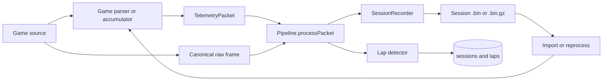

# Telemetry Recording Architecture

RaceIQ retains canonical raw source frames beside normalized lap metadata. Raw retention allows future parser, lap-detector, and derived-channel changes to reprocess existing sessions without another drive.

## Data flow


```mermaid
graph LR
  Source[Game source] --> Adapter[Game parser or accumulator]
  Adapter --> Packet[TelemetryPacket]
  Source --> Raw[Canonical raw frame]
  Packet --> Pipeline[Pipeline.processPacket]
  Raw --> Pipeline
  Pipeline --> Recorder[SessionRecorder]
  Pipeline --> Detector[Lap detector]
  Recorder --> Bin[Session .bin or .bin.gz]
  Detector --> DB[(sessions and laps)]
  Bin --> Replay[Import or reprocess]
  Replay --> Adapter
```

UDP adapters preserve original source datagrams. ACC and AC Evo pack three shared-memory pages with adapter magic and resolved ordinals. iRacing preserves versioned session/value-delta source frames. Production uses `SparseSessionRecorderAdapter` for all six games; `RealSessionRecorderAdapter` remains an independent raw baseline.

## Canonical session file

`server/session-capture/recorder.ts` writes one append-only file per session:

```text
[optional 0xFFFFFFFF u32][payload length = 4 u32][total frames u32]
[stored length u32, bit 31 set][captured UTC epoch milliseconds u64 LE][stored payload]
[stored length u32, bit 31 set][captured UTC epoch milliseconds u64 LE][stored payload]
...
```

The 12-byte capture meta header holds a frame count, **not** a format or source-contract version; historical files can omit it. New live captures timestamp each accepted source frame at UDP receipt, shared-memory triplet assembly, or native-frame poll, **before** parsing, queuing, or writing. The writer only persists the supplied time. Bit 31 in the four-byte stored-length prefix indicates an additional eight-byte unsigned little-endian UTC epoch-millisecond value before the payload; remaining bits contain the stored payload length (maximum 16 MiB). Older records retain `[u32 length][payload]` without a fabricated timestamp. Record offsets and sparse checkpoint distances include all prefix bytes. The first telemetry record creates the file; sessions with no records leave no file. `total frames`, when present, is patched when the recorder stops. A truncated final record does not invalidate earlier records for ordinary replay because each payload is length-prefixed; migration rejects truncated input. `.bin.gz` wraps the same bytes in gzip; record lengths and lap byte offsets refer to the **decompressed** stream.

Readers expose the optional acquisition timestamp as `frameTimeMs` (UTC epoch milliseconds), distinct from the simulator's `TimestampMS`.

The sparse adapter writes full source frames at session start, after context boundaries, and at most every 128 frames. LMU v2 (`LMSD`) and ACC/AC Evo (`KNSD`) retain their existing 64-byte-block layouts. Forza, F1, and iRacing use `RQSD` v1: bitmap over changed 32-byte blocks, exact source length, and checkpoint back-distance; a delta is stored only when smaller than raw. Packet identity and size must match the adjacent source frame. iRacing's existing SDK delta records often remain raw. Readers validate references and reconstruct exact source bytes before parser dispatch, including streaming Analyse replay and arbitrary lap-offset seeks. Exported lap windows rebase checkpoints for independent playback. Older builds cannot read newly sparse captures.

### Full records, sparse deltas, and versions

Every telemetry record begins with a four-byte little-endian **stored payload length**; bit 31 flags an eight-byte UTC capture timestamp before the payload in new live recordings. The game source-frame bytes are unchanged. A full record's payload is the unchanged game source frame, including any game-specific header or source-frame schema version. A sparse record's payload starts with a storage-codec magic:

Capture times preserve pauses and acquisition gaps through gzip, export, import, migration, and replay across all six games. Replay uses recorded UTC when available; simulator `TimestampMS` remains independent for games with native session clocks. ACC/AC Evo replay derives packet wall-clock time from recorded UTC; historical captures without it cannot recover original capture times. Opt-in migration preserves the absence of timestamps in historical frames; it never substitutes conversion time or a zero sentinel. Existing UTC timestamps survive migration unchanged. Inter-frame gaps indicate missing or delayed acquisition, not proof of slow disk writes; identifying recorder latency requires measuring capture-to-write or flush timing separately. Timestamped records add eight bytes per stored frame and are incompatible with older readers.

| Payload starts with | Meaning |
|---|---|
| `RQSD` (`52 51 53 44` hex) | Forza/F1/iRacing generic sparse delta; next byte is codec version `01` |
| `LMSD` | LMU sparse delta; existing layout, no RQSD version byte |
| `KNSD` | ACC/AC Evo sparse delta; existing layout, no RQSD version byte |
| No sparse magic | Full, unchanged source frame |

`RQSD` v1 layout, **inside** the length-prefixed payload:

```text
["RQSD" 4 bytes][codec version u8 = 1][checkpoint back-distance u32 LE]
[original source-frame length u32 LE][changed 32-byte-block bitmap][changed blocks]
```

The checkpoint is the latest stored **full** frame. Back-distance counts bytes from the current record's length prefix to that checkpoint's length prefix; it validates the seek/reference. Changed blocks apply to the **immediately preceding reconstructed frame**, not directly to the checkpoint. Original length is the reconstructed full source-frame size, not the sparse payload size. A raw checkpoint is written at session start, after boundaries, and at least once every 128 frames, so seeking to a lap starts by finding a nearby full frame. A file may interleave full records and deltas.

Example using an observed 331-byte headerless Forza full record followed by an **illustrative identical** frame encoded as a sparse delta:

```text
full:   4b 01 00 00 | 00 00 00 00 40 50 3d 08 ...
        length 331   | original source-frame bytes (331 total)

sparse: 0f 00 00 00 | 52 51 53 44 | 01 | 4f 01 00 00 | 4b 01 00 00 | 00 00
        length 15    | "RQSD"      | v1 | back 335     | original 331 | bitmap
```

Here `335 = 4 + 331` bytes from sparse record prefix back to full record prefix. Eleven 32-byte blocks cover 331 bytes; their two-byte zero bitmap means no blocks changed. Decoder reproduces the complete 331-byte source frame. With optional meta header, the same two records start 12 bytes later; their relative back-distance remains 335.

Codec magic/version select **stored-payload decoding**. They are separate from game source-frame schema versions (for example, LMU/iRacing) and from `sessions.capture_format_version = 1`, a DB eligibility marker. The DB marker does not select decoder; readers inspect each payload's magic and validate supported codec layout/checkpoint before forwarding reconstructed frames to game parser.

Before each write, `Pipeline.processPacket()` snapshots the recorder byte offset and passes it to the active lap detector. Completed lap rows identify the first record and frame count; sparse lap seeks restore from its nearest checkpoint (at most 128 prior records).

Session rotation can occur while a detector handles a packet. `Pipeline` compares recorder epochs, writes the triggering frame to the new file when necessary, and patches the detector's current-lap offset. This keeps lap-one offsets in the correct recording.

## Source records by game

| Game | Canonical raw record |
|---|---|
| Forza Motorsport 2023 | UDP datagram accepted by `parseForzaPacket()` |
| F1 25 | UDP datagram accepted by `F1StateAccumulator` |
| ACC | `ACCP` packed physics, graphics, and static pages |
| AC Evo | `ACEP` packed physics, graphics, and static pages |
| iRacing | `IRIQ` versioned session or value-delta source frame |
| Le Mans Ultimate | `RQLMUSF` versioned player telemetry and scoring source frame |

Shared-memory packed triplets use:

```text
[magic u32][car ordinal i32][track ordinal i32]
[physics length u32][physics]
[graphics length u32][graphics]
[static length u32][static]
```

The framing keeps `SessionRecorder` game-agnostic. Each server adapter's `tryParse()` recognizes and decodes its own raw records.

LMU live capture and committed replay fixtures use native shared-memory source frames. DuckDB remains a separate manual historical-import path. See [LMU recording decision](lmu-recording.md).

## Replay, import, and reprocessing

`server/session-capture/reprocess.ts` opens the stored capture, gunzips it when needed, walks length-prefixed records, calls the registered game parser, and feeds a fresh lap detector backed by a capturing database adapter. Matching lap counts update raw indexes and metadata in place; changed counts rebuild detected lap rows while preserving eligible user data on matched replacements.

`server/session-capture/import-capture.ts` accepts both full and sparse canonical `.bin` / `.bin.gz` uploads. It gunzips when needed; game detection and `canonicalImportFrames()` inspect each record and reconstruct sparse payloads before parsing. Full payloads pass through unchanged. Segment/context markers and recorded UTC times survive the walk. Accepted input is rewritten as a canonical RaceIQ session capture, so later replay and reprocessing do not depend on the upload's storage encoding. Six-game fixture tests compare restored source bytes and streaming parser output against an independent raw recording. Forza, F1, iRacing, and LMU simulator `TimestampMS` values are compared exactly. Historical ACC and AC Evo packed frames have no UTC capture time, so only their parser-generated wall-clock `TimestampMS` is excluded. Lap ZIP export/import has separate coverage. Direct standalone sparse-file upload follows this reader path but has not been separately smoke-tested.

Development dump files are different, adapter-specific capture formats. Use [Telemetry recordings](../contributing/telemetry-recordings.md) for fixture capture and import commands; do not treat those dump containers as production session framing.

## Compression and cleanup

`server/session-capture/compressor.ts` gzips inactive `.bin` files older than 24 hours and updates `sessions.rawFile` to the `.bin.gz` path. Reprocess and import readers restore the same byte stream transparently. User-triggered compression may also sweep unreferenced `.bin` files.

Historical canonical `.bin` and `.bin.gz` files with unknown capture-storage version are offered for explicit conversion. Startup and reconnect report eligibility only; conversion never starts until user clicks Convert. Maintenance holds one capture lock, streams decoded records into a staged output of the same compression type, preserves the presence or absence of the optional canonical meta header, verifies every restored frame and marker byte-for-byte, and remaps lap prefix offsets in one transaction without modifying lap IDs or metrics. If output is not smaller, original stays in place and is marked evaluated. Failures retain original path and lap offsets. `sessions.capture_format_version = 1` marks new sparse recordings or verified historical files; source-frame schema versions remain unchanged.

See [Session storage](../operations/session-storage.md) for lifecycle, orphan handling, and operational constraints.

## Raw capture versus exported channels

RaceIQ session capture is intentionally larger than a channel-oriented format such as MoTeC `.ld`:

- A raw frame preserves every source byte, including fields RaceIQ does not decode yet.
- A channel log stores only values selected and parsed by its exporter.
- Raw frames support future parser fixes and new derivations; omitted channel-log data cannot be reconstructed.

That trade-off does not imply higher measurement fidelity. Sample cadence, duplicate source frames, per-channel update rates, and source limitations still apply. See [Telemetry fidelity](../research/telemetry-fidelity.md).

## Reliability invariants

- Graceful shutdown flushes the session recorder and native readers before exit.
- Lap byte offsets always point to the length prefix of a canonical raw record.
- Parser and replay state are isolated per import/reprocess operation.
- Stored sparse deltas reconstruct source-format bytes before normalization; legacy records are already raw source bytes.
- Compressed and uncompressed files must decode to the same record stream.

## Implementation map

- `server/session-capture/recorder.ts` — canonical append-only writer
- `server/telemetry/live-pipeline.ts` — raw write ordering and lap offsets
- `server/games/kunos/pack-triplet.ts` — ACC and AC Evo records
- `server/session-capture/sparse-recorder.ts` — checkpointed encoder and production writer for all six games
- `server/session-capture/{lmu-sparse,kunos-sparse,generic-sparse}.ts` — source-byte-preserving delta codecs
- `server/session-capture/framing.ts` and `source-loader.ts` — bounded seeks and streaming restoration
- `server/games/iracing/source-frame.ts` — iRacing records
- `server/session-capture/import-capture.ts` — capture detection and canonical import entry
- `server/session-capture/import-pipeline.ts` — parser, detector, and persistence pipeline
- `server/session-capture/reprocess.ts` — detector replay and index refresh
- `server/session-capture/compressor.ts` — background gzip
- `server/session-capture/migrate-captures.ts` — opt-in streamed, verified capture rewrite and lap offset transaction
