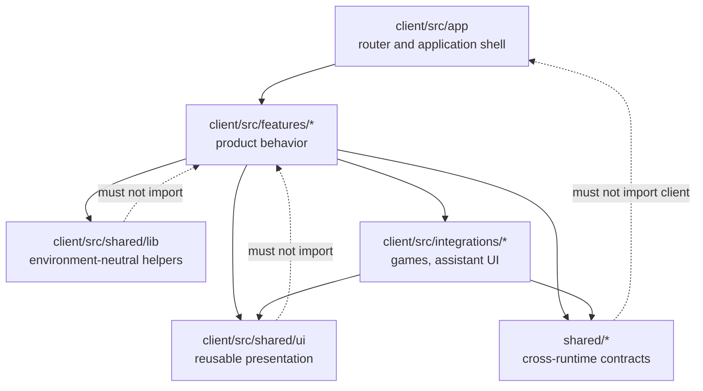
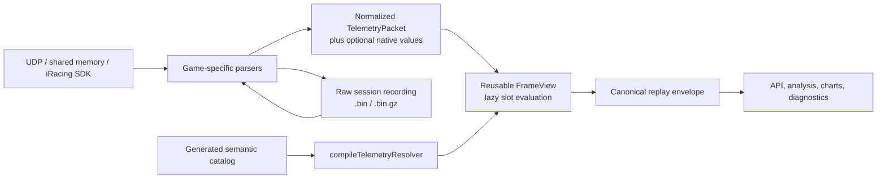

# RaceIQ `folder-cleanup` Branch Code Review

## Executive summary

**Review verdict: approve the architectural direction, but do not merge the branch in its present state.**

The folder reorganization is a substantial improvement over the previous flat, page-heavy client layout. Large orchestration components have been decomposed into feature-oriented modules, shared UI primitives have been consolidated, route responsibilities are better documented, and the server/shared/client boundaries are materially clearer. The repository now describes a coherent Bun server, React client, Hono API, SQLite-backed persistence layer, WebSocket telemetry path, TanStack Query integration, and Zustand live-state model. fileciteturn36file0L2-L2

The telemetry layer is also directionally strong. Its semantic catalog, explicit per-game mappings, units, value types, cardinality, provenance, limitations, generated hashes, resolver versioning, canonical replay model, and validation rules are more rigorous than a conventional “bag of telemetry fields” design. The catalog validator checks structural consistency, source coverage, mapping provenance, declared inputs, deterministic execution identities, unit compatibility, and shape/cardinality invariants. fileciteturn15file0L2-L2 fileciteturn16file0L2-L2 fileciteturn37file0L2-L2

The branch nevertheless carries several merge-blocking risks:

| Area | Assessment | Merge significance |
|---|---|---|
| Folder architecture | **Good direction, incomplete boundary enforcement** | The decomposition is valuable, but `client/src/components` still combines feature modules, reusable primitives, game-specific code, and integration code. |
| Telemetry model | **Strong** | Semantic contracts, provenance, mapping status, generated catalog integrity, and replay identity are well designed. |
| Telemetry correctness | **Needs changes** | The iRacing replay iterator appears to emit one frame beyond `rawFrameCount`; freshness logic also lacks a robust clock-domain model. |
| Telemetry performance | **High risk at scale** | Replay materializes complete frame-by-variable responses in memory, while existing recording tests have already reached approximately 4 GB peak RSS. fileciteturn45file0L3-L7 |
| Static analysis | **Not merge-grade** | Biome is not a required CI gate, the configuration schema is from Biome 1.9.4 while the installed tool is 2.5.6, and existing repository diagnostics are acknowledged in commit history. fileciteturn29file0L2-L2 fileciteturn46file0L3-L6 |
| Type safety | **Partially gated** | The client runs TypeScript during its build, but the root server/shared/test/scripts TypeScript project has no explicit required CI type-check step. |
| Tests and E2E | **Broad and thoughtful, but not quantitatively complete** | Real recordings, seeded E2E, visual checks, compiled-binary testing, and source contracts are strong; no coverage threshold is enforced, and the branch head did not have independently verifiable CI results during this review. |
| CI/CD | **Needs hardening** | The main workflow uses a non-frozen install, does not pin a Bun version, omits lint and root type-check gates, and uses mutable action tags. |
| Security and privacy | **Moderate risk** | The app is local-first and raw paths are not exposed in canonical replay references, but raw telemetry retention, import limits, workflow hardening, dependency scanning, and privacy controls require more explicit policy. |
| Integration risk | **High** | The branch spans a very large cross-cutting change set and had diverged from the current main branch during review. It should be rebased and revalidated as a fresh merge candidate. |

The most urgent fixes are to correct the replay frame boundary, rebase onto current `main`, establish lint and full-workspace TypeScript gates, use reproducible dependency installation, add telemetry replay memory and sampling limits, and define timestamps with explicit clock domains.

## Scope, evidence, and detected stack

The reviewed branch head was commit `5de41f7166bb74cf46fc3520b1de133337ce9c22`, whose final commit primarily updated documentation and architectural guidance. fileciteturn10file0L1-L7 The branch comparison inspected for this review showed a large, multi-commit reorganization rather than an isolated folder rename. It included client component decomposition, documentation restructuring, test organization, workflow changes, generated telemetry catalog work, replay support, and semantic telemetry contracts.

The detected implementation stack is:

| Layer | Detected technology |
|---|---|
| Runtime and package manager | Bun |
| Main language | TypeScript with strict mode |
| Client | React, Vite, TanStack Router, TanStack Query, Zustand |
| Server/API | Bun server and Hono |
| Persistence | SQLite/libSQL and Drizzle-related packages |
| Validation | Zod plus custom catalog validation |
| Unit/integration tests | Bun test |
| Browser/E2E | Playwright |
| Component/visual tests | Storybook and Playwright snapshots |
| Formatting/linting | Biome |
| Telemetry persistence | SQLite metadata plus raw `.bin` or `.bin.gz` session recordings |

The root TypeScript project uses strict mode, bundler module resolution, shared path aliases, declaration/source maps, and includes server, shared, test, and script code. fileciteturn30file0L2-L2 The client configuration adds strict unused-symbol checks, fallthrough protection, side-effect import checking, and no-emission type checking. fileciteturn31file0L2-L2

The application is explicitly local-first. Its README states that telemetry, the database, settings, recordings, and generated data remain on the user’s machine unless an external AI provider is configured. fileciteturn35file0L2-L2

**Execution limitation.** Repository inspection, branch comparison, commit history, source review, configuration review, and documented test results were available. A clean local clone and independent execution of Bun, Biome, TypeScript, coverage, and Playwright were not possible in the review environment. Accordingly:

| Check | Evidence available | Confidence |
|---|---|---|
| Biome | Configuration and repository commit reports | Configuration-level conclusion; not an independent clean run |
| Client TypeScript/build | Build scripts and repository-reported successful builds | Moderate |
| Root TypeScript | Configuration inspection; no required CI step found | High confidence in gate deficiency, not in current error count |
| Bun tests | Repository documentation reports 2,734 passing tests and one skip at its latest local gate | Reported, not independently reproduced |
| E2E | Detailed documented results and fixture limitations | Reported, not independently reproduced |
| Coverage | No enforced coverage command or threshold found | High |
| Head CI | No current successful head workflow evidence was available during review | High |

The repository’s E2E documentation is unusually candid about this distinction. It reports a large locally executable test gate but explicitly says those results do not prove GitHub-hosted CI execution, physical-device behavior, configured external AI quality, or transitions absent from committed recordings. fileciteturn26file0L2-L2

## Folder reorganization and maintainability

The principal improvement is the move from large, flat page components to feature-local modules. The branch decomposes former page-sized modules such as analysis, comparison, sessions, settings, onboarding, cars, track rendering, live-track rendering, AI chat, and tuning into smaller files under feature folders. The new contributor guidance explicitly says that feature pages and their local hooks, helpers, types, and presentation code belong under `client/src/components/<feature>/`, while genuinely cross-feature code should move into `hooks`, `lib`, `stores`, or `data` only after multiple consumers exist. It also prescribes direct imports, no barrel files, relative imports within features, aliases across feature boundaries, and thin route files. fileciteturn10file0L56-L75

The server route organization follows a similarly sensible domain model. `server/routes` separates lap, track, tune, experiment, game, system, and development concerns, while documenting route stability, registration order, transport validation, production/development boundaries, and focused route testing. fileciteturn40file0L2-L2

These are good choices because they make ownership visible and reduce several recurring failure modes:

- Page orchestration no longer has to own every table, modal, drawing helper, state transition, and API interaction.
- Feature-local types and helpers reduce premature placement in generic “utils” directories.
- Direct leaf imports make dependencies more explicit and reduce accidental cyclic dependency chains.
- Thin routes reduce coupling between URL details and domain/UI behavior.
- Test files can follow the same domain ownership model as production code. The new test guide explicitly separates domain tests, reusable support, deterministic fixtures, generated artifacts, benchmarks, and AI evaluations. fileciteturn25file0L2-L2

The remaining weakness is that `client/src/components` has become a de facto application architecture root rather than a component directory. It now contains at least four different abstractions:

| Current category under `components` | Architectural meaning | Concern |
|---|---|---|
| `components/analyse`, `cars`, `sessions`, `settings`, `home` | Product features/pages | These are feature modules, not merely components. |
| `components/ui` | Reusable primitives | This is a valid shared component layer. |
| `components/f1`, `acc`, `ac-evo`, `iracing` | Game-specific implementation | These are adapter/presentation integrations. |
| `components/assistant-ui`, `ai-chat`, `ai` | AI-provider and assistant integration | These have different dependency and privacy concerns from ordinary UI. |
| `components/telemetry`, `dashes`, `live-track` | Domain visualization | These straddle reusable UI and telemetry-domain behavior. |

A clearer long-term structure would be:

| Current | Recommended target | Rationale |
|---|---|---|
| `client/src/components/<feature>` | `client/src/features/<feature>` | Names the directory by architectural role. |
| `client/src/components/ui` | `client/src/shared/ui` | Makes reusable UI ownership explicit. |
| `client/src/components/assistant-ui` | `client/src/integrations/assistant-ui` | Separates external/integration-driven UI from product features. |
| `client/src/components/f1`, `acc`, etc. | `client/src/features/<feature>/games/*` or `client/src/integrations/games/*` | Keeps game-specific rendering close to the capability that consumes it. |
| `client/src/routes` | `client/src/app/routes` | Clarifies that route composition is an application-shell concern. |
| `client/src/lib` | `client/src/shared/lib` plus feature-local helpers | Prevents `lib` from becoming an unowned dumping ground. |
| `client/src/hooks` | Feature-local hooks first; `shared/hooks` for proven reuse | Aligns ownership with the contributor guidance. |
| `server/routes` | Keep current route structure | It already has coherent domain boundaries. |
| `shared/telemetry` | Keep current structure | It is a well-defined cross-runtime domain package. |

A second mass move should **not** be made immediately. The safer sequence is to enforce the intended dependency rules first, then rename top-level directories only when the branch is stable. Otherwise, another large path-only diff would obscure correctness fixes and generate unnecessary merge conflicts.

A useful target dependency model is:



The “no barrels” policy improves dependency visibility, but it is not by itself an architectural boundary. Add automated import restrictions so `shared/ui` cannot import features, one feature cannot silently reach into another feature’s internals, and browser code cannot enter Node-only server modules.

Maintainability is also affected by formatting. The Biome configuration allows lines up to 200 characters, and several telemetry files consequently compress constructors, methods, and multi-step state logic onto single lines. fileciteturn29file0L2-L2 This reduces vertical size but makes reviews, blame history, debugging, and branch conflict resolution materially harder. A target of 100–120 characters is more appropriate for logic-heavy TypeScript.

## Telemetry architecture and implementation

The semantic telemetry design is the strongest part of the branch.

The catalog defines semantic variables independently from simulator-native packet names. Each variable can specify canonical units, dimensions, value type, cardinality, ordering, range, enum domain, structured schema, limitations, packet fields, shape, and per-game availability or mapping behavior. Game links distinguish direct, normalized, derived, simplified, and unavailable values. fileciteturn16file0L2-L2

The generated catalog records:

- Catalog, schema, generator, and content versions.
- Provenance artifact and commit identity.
- Deterministic execution identity and code hash for transformations.
- Declared source inputs and missing-data policy.
- Source kinds and retention classifications.
- Per-game source coverage.
- Unsupported values and explicit reasons.
- Semantic mapping limitations.

The validator goes beyond schema shape. It verifies hashes, generated metadata, unique nodes, parent-child links, enum domains, ranges, cardinality, wheel/vector ordering, mapping completeness for every known game, source existence, unit compatibility, deterministic execution metadata, declared source inputs, retention consistency, and source-count coverage. fileciteturn37file0L2-L2

The replay path can be summarized as follows:



The resolver compiles only requested semantics, detects derivation cycles, orders dependencies, selects direct/native/derived readers, rejects required unavailable semantics, and associates each plan with a freshness threshold. fileciteturn17file0L2-L2 `FrameView` reuses typed arrays and value storage across frames, lazily evaluates slots, tracks derived dependencies, canonicalizes values, and surfaces mapping state and confidence. fileciteturn21file0L2-L2

The replay contract also has several good privacy and reproducibility properties. It stores an object identity and content hash instead of exposing a local capture path, and carries catalog, parser, resolver, derivation, and recording-version identity. fileciteturn18file0L2-L2 Canonicalization rejects non-finite numbers, cycles, sparse arrays, accessors, symbols, and non-plain objects before replay output is detached. fileciteturn19file0L2-L2

The following issues need attention.

| Severity | Finding | Analysis |
|---|---|---|
| **High** | iRacing replay frame-count boundary is off by one | `iterateIRacingNativeFrames` checks `replayFrames > source.rawFrameCount` before incrementing and yielding. With a count of `N`, the loop can process the `N + 1`th frame. |
| **High** | Freshness uses an ambiguous or ineffective timestamp relationship | `queryLapTelemetryBySemanticId` passes `packet.TimestampMS` as the frame time, while `FrameView.sourceTimestamp()` commonly reads the same `TimestampMS`; the computed age is therefore normally zero for packet-backed values. |
| **High** | Replay responses are fully materialized | The server allocates an envelope for every stored telemetry packet and a canonical value for every requested semantic before returning. |
| **Medium** | No query-level sampling policy | The API accepts semantic IDs but not a target rate, point budget, aggregation method, or transient-preserving reduction mode. |
| **Medium** | Errors lose diagnostic detail | `FrameView.evaluate` catches all exceptions and changes the state to `error`, but discards the exception type, message, source, and offset. |
| **Medium** | Transport format is not fully explicit | The canonical envelope uses `bigint` for sequence identity. Standard JSON serialization cannot directly serialize a `bigint`; an HTTP DTO must encode it as a string or safe number. |
| **Medium** | No explicit envelope format discriminator | Catalog format and schema versions are present, but the replay envelope itself should have a stable format/version identifier. |
| **Medium** | Sampling fidelity differs by source | Repository measurements found AC Evo capture at about 63.5 Hz rather than the intended 100 Hz, with duplicate frames reducing distinct samples to about 39.5 Hz; the loss was material for transient channels. fileciteturn44file0L3-L6 |
| **Medium** | Retention is operationally fixed | Raw sessions are compressed and orphan-cleaned, but documented age thresholds and maintenance intervals are code constants rather than user-configurable policy. fileciteturn32file0L2-L2 |

The frame-count defect should be corrected immediately:

```diff
diff --git a/server/telemetry/replay.ts b/server/telemetry/replay.ts
@@
-    if (replayFrames > source.rawFrameCount) break;
+    if (replayFrames >= source.rawFrameCount) break;
     replayFrames += 1;
     if (decoded) yield decoded.values;
```

Tests should cover `rawFrameCount` values of zero, one, and a normal lap count, and assert both the yielded frame count and the final frame’s source offset. The test should also include a following-lap trigger frame to prove it is not accidentally attached to the requested lap.

Freshness should be redesigned around explicit clock domains. A source-relative timer, session timer, monotonic process clock, and Unix wall-clock value must not be compared interchangeably.

```ts
export type TelemetryTimestamp =
  | { readonly domain: "wall-clock"; readonly milliseconds: number }
  | { readonly domain: "session"; readonly milliseconds: number }
  | { readonly domain: "monotonic"; readonly nanoseconds: bigint };

export interface SourceObservation {
  readonly timestamp: TelemetryTimestamp;
  readonly updateSequence: bigint;
}
```

Each source reader should return the timestamp at which that particular source changed. Static setup information, pit snapshots, session metadata, and continuously streamed physics should not inherit one generic packet timestamp. A freshness calculation should only subtract values with matching domains; otherwise it should report freshness as unknown rather than silently treating the value as current.

Replay should also support bounded and streaming consumption:

```ts
export interface TelemetrySamplingOptions {
  readonly mode: "raw" | "uniform" | "min-max";
  readonly maxPoints?: number;
  readonly targetHz?: number;
}

export interface SemanticReplayQuery {
  readonly semanticIds: readonly string[];
  readonly sampling?: TelemetrySamplingOptions;
  readonly includeRawReference?: boolean;
}
```

For UI charts, a min/max bucket strategy preserves transient spikes better than simple point skipping. For analysis and export, raw mode should remain available. The server should expose an async iterator, chunked response, or pagination path so one long session cannot force the entire semantic representation into memory.

Instrumentation should record at least:

| Metric | Purpose |
|---|---|
| Frames read, decoded, skipped, malformed, and returned | Detect source/replay drift |
| Duplicate-frame ratio | Expose effective sampling rate |
| Source rate and distinct-value rate by channel class | Distinguish smooth from transient data quality |
| Resolver compile time and cache hits | Detect catalog/resolver regressions |
| Resolution counts by `ok`, `missing`, `stale`, `invalid`, `error`, and `not-applicable` | Measure semantic availability |
| Replay bytes read, peak buffered bytes, output points, and elapsed time | Enforce performance budgets |
| Derivation failures by semantic ID and version | Make hidden resolver errors actionable |
| Catalog hash and parser/resolver versions | Preserve reproducibility |

## Static analysis, testing, build, and delivery

The repository has strong test design but weak enforcement consistency.

The test layout is thoughtfully documented. It separates unit, integration, native-recording E2E, browser E2E, benchmark, AI evaluation, deterministic fixtures, reusable support, and generated artifacts. It also protects user data by preloading a test-only `DATA_DIR` for all Bun tests. fileciteturn25file0L2-L2 fileciteturn34file0L2-L2

The telemetry E2E documentation distinguishes dynamic, static, event, unsupported, and fixture-limited values instead of treating every unchanged field as a passing dynamic test. It documents 235 source-level contracts, seeded browser checks, real production parsers, compiled-binary lanes, responsive screenshots, device emulation, and known fixture gaps. fileciteturn26file0L2-L2 This is a strong testing philosophy and aligns with Playwright’s guidance to test user-visible behavior and keep tests isolated. citeturn5search0

However, the required workflow currently performs dependency installation, telemetry catalog validation, the client build, and Bun tests without an explicit Biome gate or a full root TypeScript gate. fileciteturn27file0L2-L2

The static-analysis findings are:

| Tool or gate | Current condition | Review |
|---|---|---|
| Biome version/config | Installed client tool is Biome 2.5.6; root schema references 1.9.4 | Run the official migration and review changed rules. Biome documents `biome migrate --write` for major-version configuration migration. citeturn3search0 |
| Biome CI | Not present in the main build-test workflow | Merge blocker for a large refactor. |
| Biome rules | Exhaustive dependencies, non-null assertion, explicit `any`, SVG title, and keyboard/click checks are disabled | Some exceptions may be legitimate, but broad global disabling hides regressions. |
| Biome line width | 200 characters | Excessive for complex state and telemetry code. |
| Existing diagnostics | Repository commit history acknowledges outstanding lint diagnostics | The refactor must baseline and then eliminate or explicitly waive them. fileciteturn46file0L3-L6 |
| Client type checking | `vite build && tsc -b` | Type checking occurs, but only after bundling. Vite transpiles TypeScript and does not perform semantic type checking itself. citeturn3search3 |
| Root type checking | Strict root `tsconfig`, but no explicit required root `tsc --noEmit` CI step | Server/shared/scripts/test type errors can escape the mandatory workflow. |
| Coverage | No threshold or coverage artifact found | Add coverage for core semantic and persistence modules. Bun supports text and LCOV coverage plus threshold configuration. citeturn4search0turn4search4 |
| Test resource use | Full suite historically reached about 3.97 GB RSS | Split heavyweight recording tests and stream fixtures. fileciteturn45file0L3-L7 |
| E2E retries/artifacts | Extensive documented artifact strategy | Good, but flaky retries must remain diagnostic rather than concealing instability. |

A minimal script correction is:

```diff
diff --git a/client/package.json b/client/package.json
@@
-    "build": "vite build && tsc -b",
+    "typecheck": "tsc -b --pretty false",
+    "build": "bun run typecheck && vite build",
```

At the root:

```diff
diff --git a/package.json b/package.json
@@
   "scripts": {
+    "lint": "biome check client/src server shared scripts test playwright",
+    "typecheck": "tsc -p tsconfig.json --noEmit --pretty false",
+    "check": "bun run lint && bun run typecheck && bun run test",
+    "test:coverage": "bun test --coverage",
```

The CI workflow should become reproducible and fail early:

```diff
diff --git a/.github/workflows/build-test.yml b/.github/workflows/build-test.yml
@@
       - uses: oven-sh/setup-bun@v2
+        with:
+          bun-version: 1.3.14

       - name: Install dependencies
-        run: bun install
+        run: bun install --frozen-lockfile
+
+      - name: Lint
+        run: bun run lint
+
+      - name: Type check workspace
+        run: bun run typecheck
```

The Bun version shown here matches the version already pinned in the branch’s native replay workflow; the exact version should be controlled centrally rather than duplicated. fileciteturn28file0L2-L2

Coverage should initially gate only risk-critical modules so adoption does not devolve into low-value tests written to satisfy a global percentage:

| Initial coverage scope | Recommended threshold |
|---|---:|
| `shared/telemetry/catalog` | 90% branch |
| `shared/telemetry/resolver` | 90% branch |
| `shared/telemetry/replay` | 95% branch |
| `server/telemetry/replay.ts` | 95% branch |
| Session framing and identity | 95% branch |
| Migration helpers | 90% branch |

The telemetry test matrix should add property-based and fuzz coverage for malformed frame lengths, truncated gzip input, invalid cardinality, cycles, extreme arrays, clock discontinuities, non-finite values, unknown semantic IDs, derivation cycles, stale values, and raw-frame boundaries.

## Security, performance, and compatibility

The application’s local-first model reduces exposure compared with a cloud telemetry service, and the canonical replay contract deliberately avoids exposing local filesystem paths. fileciteturn18file0L2-L2 Even so, raw telemetry is sensitive behavioral data. It can reveal precise vehicle inputs, timing, track activity, game/session identity, hardware-adjacent behavior, and potentially user-provided setup or AI context.

The privacy model should distinguish four data classes:

| Data class | Examples | Recommended policy |
|---|---|---|
| Raw capture | UDP frames, shared-memory source frames | Local by default; configurable retention and explicit export |
| Normalized telemetry | `TelemetryPacket` and semantic envelopes | Local; derived copies deleted with source session unless explicitly retained |
| Diagnostics | Logs, parser failures, catalog identity | Redact local paths, tokens, provider requests, and user-generated text |
| External AI context | Lap summaries, chat, setup information | Explicit provider disclosure and per-request review or opt-in |

The documented session maintenance system compresses old recordings and deletes orphan files, but its intervals and age thresholds are fixed code constants. fileciteturn32file0L2-L2 Add user-facing controls for maximum age, maximum storage size, per-game retention, automatic deletion, and “delete raw after derived processing.” Diagnostics and export flows should state whether raw bytes, semantic data, chat metadata, or setup details are included.

Untrusted telemetry imports need explicit resource limits even if current parsers perform frame-length checks:

- Maximum compressed and decompressed size.
- Maximum compression ratio.
- Maximum frame count and frame length.
- Maximum semantic value depth and collection cardinality.
- Wall-clock timeout and abort signal.
- Per-session memory budget.
- Safe temporary-file handling.
- Clear rejection of unsupported container versions.
- Fuzz tests for every parser and framing layer.

The main performance problem is already visible in test execution. A prior CI investigation measured approximately 1.27 GB peak RSS for one large fixture and approximately 3.97 GB for the full suite because packet arrays accumulated in one Bun process. fileciteturn45file0L3-L7 The current workflow works around this with a larger runner, but that treats the symptom rather than the dataflow.

Recommended performance budgets are:

| Operation | Proposed budget |
|---|---:|
| Resolver compilation for 50 requested semantics | Under 10 ms after catalog load |
| Frame resolution | No unbounded per-frame allocations |
| One-lap semantic replay | Under 2× raw capture size peak incremental RSS |
| Chart query | At most configured `maxPoints` per semantic |
| Duplicate-frame ratio | Alert above source-specific threshold |
| Recording E2E process | Under 1.5 GB peak RSS per test shard |
| Catalog generation check | Deterministic, byte-identical output |
| Replay error handling | Partial diagnostic result before process termination where safe |

Compatibility risks fall into four categories.

**Import-path compatibility.** The branch deliberately discourages compatibility exports and old-path shims. That is appropriate for an application repository, but every moved import must be covered by a full workspace type check. Tests should also detect any dynamically constructed import or lazy route that TypeScript does not follow.

**Route and deep-link compatibility.** Route consolidation must preserve public game prefixes, search parameters, capability guards, browser history, and generated TanStack route metadata. The documentation explicitly treats route paths and response shapes as stable contracts. fileciteturn40file0L2-L2 Add a table-driven route compatibility test containing every previously supported deep link.

**Replay compatibility.** Raw recordings are intentionally retained so future parsers can reprocess them. That is valuable, but “current parser replay” does not guarantee identical historical results after parser, lap-detector, resolver, or derivation changes. Every replay result should expose both the recorded-with version and processed-with version, as the new contract already begins to do. fileciteturn18file0L2-L2 Golden compatibility fixtures should prove behavior across at least the previous two released parser/catalog generations.

**Transport compatibility.** Before canonical replay is exposed through Hono JSON, convert `bigint` fields to versioned strings and add a format discriminator:

```ts
export interface CanonicalTelemetryEnvelopeDto {
  readonly format: "raceiq-semantic-replay-v1";
  readonly sequence: string;
  readonly observedAt: number;
  readonly values: readonly CanonicalTelemetryValueDto[];
}
```

The CI supply chain also needs hardening. The build workflow uses mutable major-version action tags and does not show explicit least-privilege permissions. GitHub recommends explicitly limiting `GITHUB_TOKEN` permissions and pinning third-party actions to full commit SHAs where practical. citeturn4search7

No repository-committed Dependabot or CodeQL workflow was found during inspection; default setup may still be enabled through repository or organization settings and should be verified rather than assumed absent. GitHub’s supported supply-chain controls include dependency review, Dependabot, dependency graph analysis, and artifact attestations. citeturn5search1 CodeQL supports JavaScript/TypeScript and GitHub Actions analysis and should be enabled through default setup or a reviewed workflow. citeturn5search2turn5search9

## Prioritized recommendations and follow-up checklist

### Action plan

| Priority | Recommendation | Risk if deferred | Effort |
|---|---|---:|---:|
| **Blocker** | Correct the iRacing replay `rawFrameCount` boundary and add exact-count regression tests | High: cross-lap telemetry contamination | XS |
| **Blocker** | Rebase the branch onto current `main`, resolve generated artifacts and migration conflicts, and require a fresh full CI run | High: merge regressions and stale fixes | M |
| **Blocker** | Add required Biome and root TypeScript gates | High: moved imports and server/shared type errors can escape | S |
| **Blocker** | Use `bun install --frozen-lockfile` and pin Bun consistently | High: non-reproducible CI and dependency drift | XS |
| **High** | Migrate the Biome configuration to the installed major version and reduce line width | Medium-high: inconsistent diagnostics and poor reviewability | S–M |
| **High** | Define telemetry clock domains and source-specific observation timestamps | High: false freshness and stale-value misclassification | M |
| **High** | Stream replay output and add `maxPoints`, target-rate, and min/max sampling options | High: memory exhaustion and oversized responses | M–L |
| **High** | Add replay/parser memory and throughput benchmarks to CI with budgets | High: the existing 4 GB test profile can regress further | M |
| **High** | Add import size, decompression, frame-count, and timeout limits | High: denial-of-service through malformed or oversized capture input | M |
| **High** | Add user-configurable raw telemetry retention and documented diagnostics/AI data flows | Medium-high: privacy and disk-growth risk | M |
| **Medium** | Add an explicit replay envelope format and JSON-safe sequence representation | Medium: API serialization and future migration risk | S |
| **Medium** | Enforce client feature dependency boundaries before making more folder moves | Medium: architectural erosion and cycles | M |
| **Medium** | Add targeted coverage thresholds for telemetry, framing, replay, and migrations | Medium: correctness regressions in high-risk code | M |
| **Medium** | Split heavyweight recording tests into isolated processes or shards and stream fixture parsing | Medium: CI instability and excessive runner requirements | M |
| **Medium** | Enable dependency review, CodeQL, workflow least privilege, and action SHA pinning | Medium: supply-chain and workflow risk | S–M |
| **Medium** | Add compatibility fixtures across parser/catalog versions and a route deep-link matrix | Medium: silent behavior changes after refactor | M |
| **Low** | Rename `components/<feature>` to `features/<feature>` after stabilization | Low: naming ambiguity, not immediate correctness | M |

Effort scale: **XS** under one day, **S** roughly one to two days, **M** several days, **L** approximately one or more focused engineering weeks.

### Files requiring focused review

| File or area | Major issue or reason for scrutiny |
|---|---|
| `server/telemetry/replay.ts` | Off-by-one native-frame boundary, full replay materialization, timestamp fallback behavior |
| `shared/telemetry/resolver/frame-view.ts` | Freshness clock model, swallowed exception details, dense state encoding |
| `shared/telemetry/resolver/compile.ts` | Dense formatting, resolver diagnostics, compile/cache observability |
| `shared/telemetry/replay/contracts.ts` | `bigint` JSON transport, missing envelope format discriminator |
| `shared/telemetry/replay/canonicalize.ts` | Add depth and collection-size limits for hostile input |
| `shared/telemetry/catalog/validation.ts` | Excellent checks but oversized single validation function; split by contract area |
| `shared/telemetry/catalog/generated/*` | Must remain generator-owned and deterministic |
| `biome.json` | Biome 1.9.4 schema versus 2.5.6 tool, broad rule exemptions, 200-character width |
| Root `package.json` | Missing required full-workspace type-check and coverage gates |
| `client/package.json` | Build runs Vite before TypeScript; dependency ranges should be reviewed |
| `.github/workflows/build-test.yml` | No lint/root type check, non-frozen install, unpinned Bun, workflow hardening |
| `.github/workflows/native-replay.yml` | Good source limitations, but align shared CI setup and Bun version centrally |
| `client/src/components/*` | Improved decomposition but overloaded architectural meaning |
| `test/e2e` and recording fixtures | Excessive retained arrays and process memory |
| `docs/contributing/e2e-testing.md` | Strong evidence inventory; automate generation of the reported gate summary |
| `docs/operations/session-storage.md` | Retention controls are operational constants rather than user policy |

### Follow-up checklist

- [ ] Rebase `folder-cleanup` onto the latest `main` and regenerate all generated telemetry and route artifacts.
- [ ] Correct and test the iRacing frame-count boundary.
- [ ] Run `biome migrate --write`, review every rule change, and remove broad exemptions where possible.
- [ ] Make Biome, root TypeScript, client TypeScript, catalog determinism, unit/integration tests, and Playwright required checks.
- [ ] Use a frozen lockfile and one centrally defined Bun version in all workflows.
- [ ] Produce and retain LCOV, test result, Playwright trace, and telemetry benchmark artifacts.
- [ ] Add telemetry clock-domain and stale-value tests.
- [ ] Add replay chunking, sampling, cancellation, and point limits.
- [ ] Add duplicate-rate, source-rate, resolver-state, memory, and replay-duration instrumentation.
- [ ] Add compressed/decompressed import limits and parser fuzz tests.
- [ ] Verify JSON serialization of every replay DTO, especially `bigint`.
- [ ] Add a replay format discriminator and compatibility fixtures.
- [ ] Add route/deep-link contract tests for every supported game prefix and capability-gated page.
- [ ] Split memory-heavy recording tests into isolated invocations and stream parsers where full arrays are unnecessary.
- [ ] Add user-configurable retention limits and document telemetry, diagnostics, and AI-provider data flows.
- [ ] Verify CodeQL, dependency review, Dependabot, secret scanning, and artifact attestation settings.
- [ ] Add import-boundary enforcement before undertaking any additional directory renaming.
- [ ] Require a final clean run on Linux and the compiled Windows lane before merge.

The branch establishes a credible long-term architecture: feature-local frontend ownership, domain-oriented server routes, generated semantic telemetry contracts, explicit provenance, and production-recording-based tests. The remaining work is primarily about making that architecture enforceable and operationally safe. Once the replay boundary defect, quality gates, timestamp model, replay memory behavior, and branch integration risks are addressed, the folder cleanup and telemetry layer should be suitable for merge.