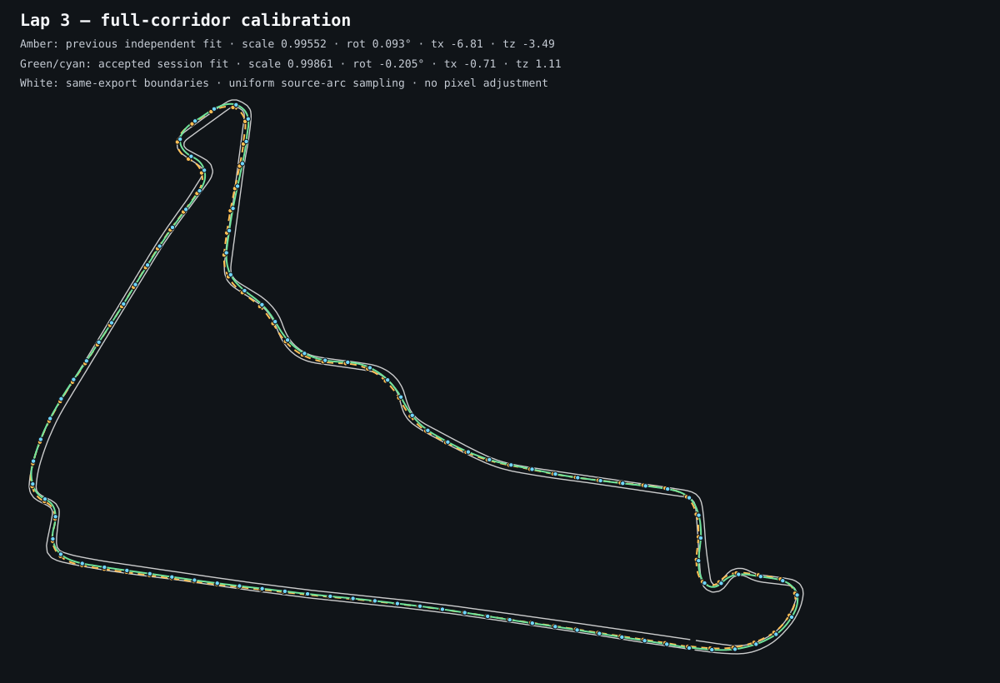
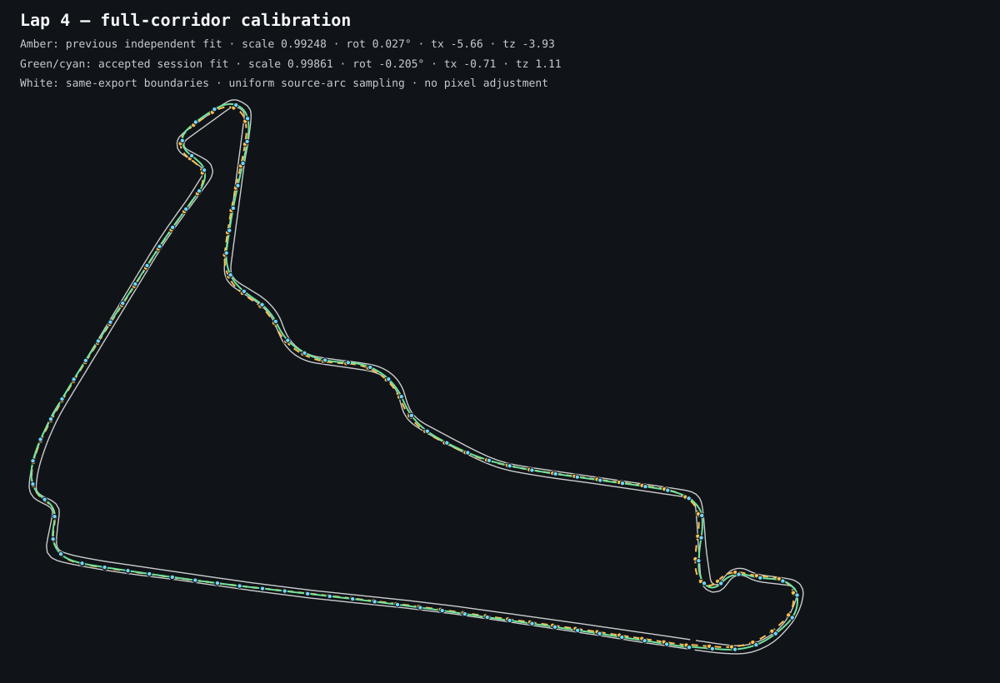
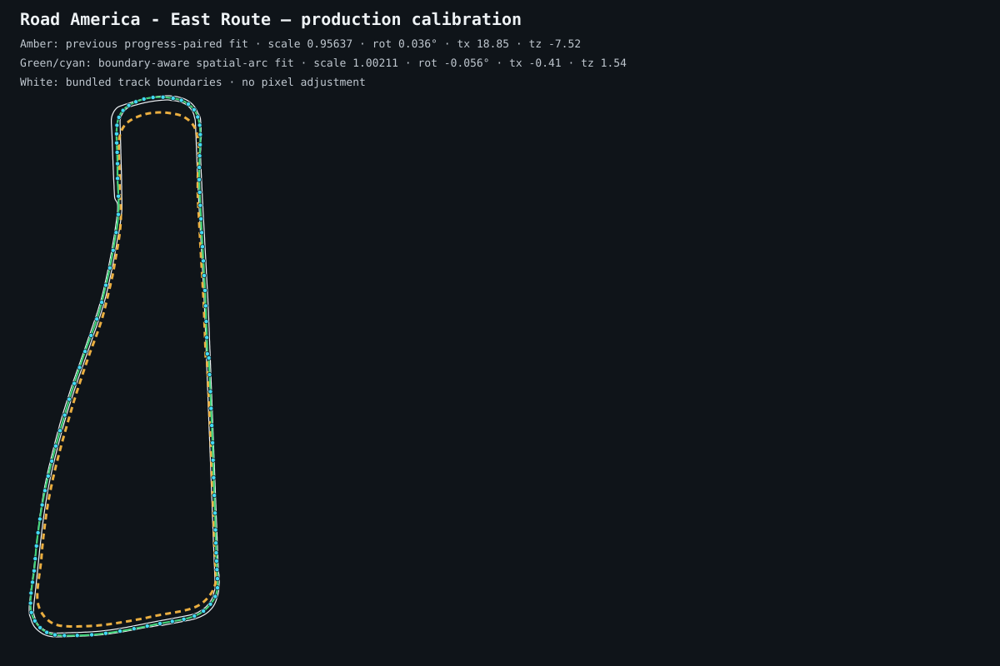
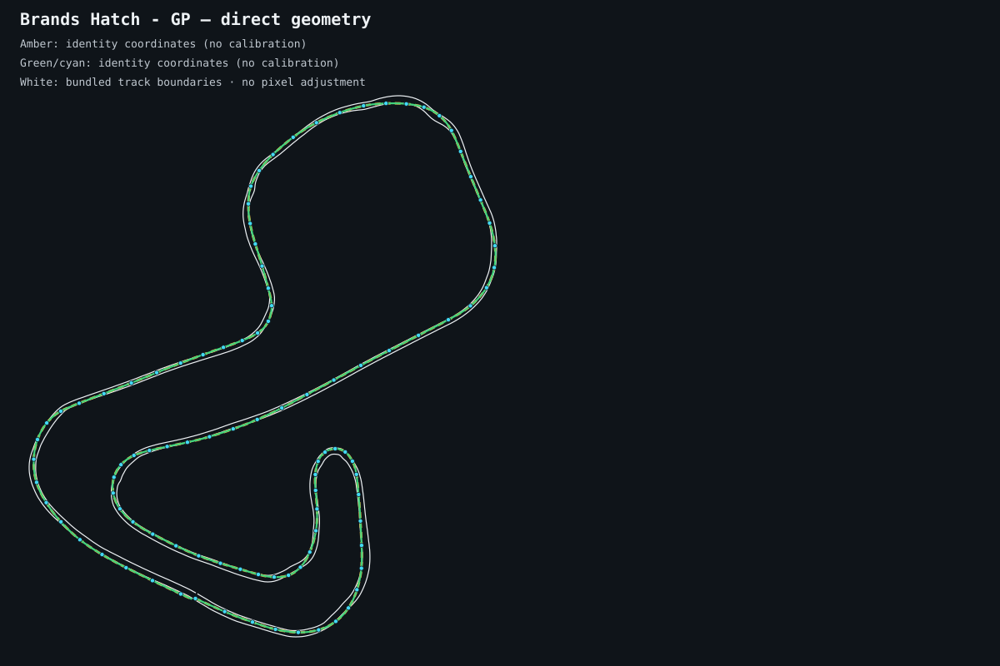
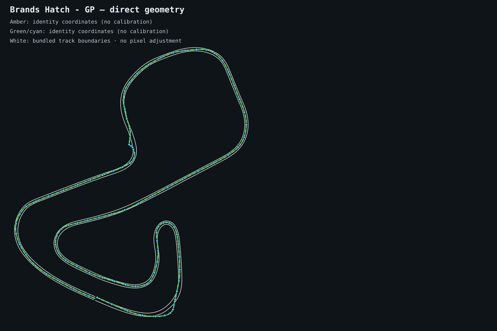

# Tracks

## Purpose

Resolve a game and track ordinal into shared track metadata, and align bundled track geometry with recorded game coordinates. This domain owns process-local calibration state and exposes track information to server callers.

## Structure

- `info.ts` is the track-resolution entry point. `resolveTrack` returns names, facts, game geometry, labelled segments, sectors, and lazy outline/length accessors.
- `calibration.ts` collects driven positions, computes live or static Procrustes transforms, refines static alignment with curb anchors, and transforms bundled geometry into source coordinates.

## Boundaries and invariants

- Track slugs come from server game adapters; facts, geometry, sectors, outlines, and names remain owned by shared track-data and car-data modules.
- Resolution preserves the fallback chain: game-specific geometry, ordinal sectors, then thirds; display names fall back to the game roster name.
- Calibration caches are keyed by track ordinal and live for the server process. Live calibration takes precedence over static alignment; cache clearing removes static and curb-refinement state together.
- Sampling thresholds, arc-length correspondence, offset search, curb weighting, transform direction, and returned coordinate/name values are behavior contracts.

## Live fit calibration

The game supplies stable world coordinates, but bundled TUMFTM/OSM geometry uses a different coordinate frame. Calibration solves the fixed similarity transform between them:

```text
outlinePoint = scale × rotate(sourcePoint, rotation) + (tx, tz)
```

`scale` and `rotation` describe the coordinate-frame relationship; `tx` and `tz` place the two origins. Consumers drawing bundled outlines in game coordinates use the inverse transform through `transformToSourceSpace`.

### Evidence collection

`LiveTelemetryPipeline` feeds valid `PositionX`/`PositionZ` samples, normalized `DistanceTraveled / trackLength` progress, and game-specific boundaries into `feedCalibrationPosition`. Imported captures replay through the same pipeline, so live recording and import use identical calibration semantics.

- Evidence is bounded to 100 progress bins: at most one representative per 1% of a lap.
- A later lap may replace a bin while calibration is still collecting.
- A fit requires more than 50 populated bins and a detected lap transition.
- When evidence covers at least 80% of a lap, samples are resampled uniformly by driven spatial arc. Individual segment lengths are capped at four times the median before arc accumulation so a teleport or invalid excursion cannot dominate correspondence.

### Fit

1. Build a target centerline by interpolating corresponding left/right boundary points. Fall back to the supplied outline when boundaries are unavailable.
2. Pair uniformly spaced driven samples with the same normalized fractions on the target centerline.
3. Solve `scale`, `rotation`, `tx`, and `tz` together with Procrustes alignment.
4. If at least 80% of the full-fit samples lie within their local half-width plus a 0.5 m tolerance, keep the full-lap fit. Otherwise, seed candidates from overlapping 20% windows, choose the transform with the most in-bound samples, and refit all of those inliers.
5. Without boundary geometry, run two robust passes retaining the lowest-error 80% each time, then refine correspondence only within a monotonic ±4% progress window. This prevents hairpins from matching the wrong nearby branch.

The fit intentionally uses the whole valid racing line rather than forcing every point onto the centerline. Boundary checks reject physically impossible correspondence; they do not erase legitimate lateral line choice.

### Session lifecycle

The first accepted live transform is frozen for the rest of the telemetry session. Later laps update neither rotation nor scale nor translation. `resetLiveCalibration` clears live evidence and the accepted transform at an independent session/import boundary while preserving static alignment. Static alignment remains the fallback until a live fit exists.

`calibrateFromPositions` supports explicit stored-lap calibration. It spatially downsamples positions, fills the same 100-bin budget, applies boundary-aware fitting when boundaries exist, and records the accepted transform.

### Game applicability and visual comparison

Calibration is selected by each server game adapter:

| Game | `requiresTrackCalibration` | Runtime behavior |
| --- | --- | --- |
| F1 25 | `true` | Fit telemetry coordinates to bundled F1 geometry once per session. |
| Forza Motorsport | `true` | Fit telemetry coordinates to bundled Forza geometry once per session. |
| Assetto Corsa Competizione | `false` | Extracted boundaries already use ACC world coordinates; use identity alignment. |
| Assetto Corsa EVO | `false` | Extracted boundaries already use AC EVO world coordinates; use identity alignment. |

The fitting algorithm is game-independent. F1 and Forza supply the same canonical position/progress inputs and differ only in their track data. ACC and AC EVO bypass calibration deliberately; applying another fitted transform would distort geometry that already shares the telemetry frame.

White lines below are bundled track edges, amber is previous behavior, green is current behavior, and cyan dots are representative telemetry positions. Rendering applies no pixel correction.

#### F1 25 — Mexico





#### Forza Motorsport — Road America East

Amber shows the previous progress-paired fit. Green shows the boundary-aware, spatial-arc fit.



#### Assetto Corsa Competizione — Brands Hatch GP

Amber and green both use the identity transform and therefore overlap. The recorded racing line already sits between the exported ACC boundaries.



#### Assetto Corsa EVO — Brands Hatch GP

Amber and green both use the identity transform and therefore overlap. The recorded racing line already sits between the exported AC EVO boundaries.



## Testing

Cover track resolution with known and unknown game/ordinal combinations, including lazy outline access. Calibration tests must cover transform recovery, normalized progress, bounded bin replacement, multiple lateral racing lines, sparse evidence, extreme outliers, full-corridor containment, accepted-transform freezing, session reset, history bounds, live-over-static precedence, and explicit stored-lap fitting. Use fixed position, outline, and boundary fixtures so regressions fail deterministically.
